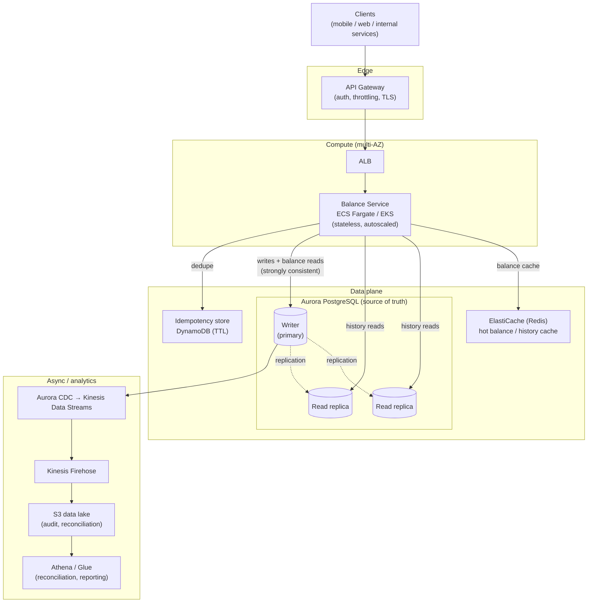

# 4. High-Level Design

## Architecture (AWS)

## Component responsibilities

| Component | Role | Why this service |
|-----------|------|------------------|
| **API Gateway** | TLS termination, authn, rate limiting, request validation | Managed edge; offloads cross-cutting concerns from the service. |
| **Balance Service (ECS Fargate/EKS)** | Stateless business logic: validate, enforce rules, run DB transactions | Stateless → horizontal autoscaling; all state lives in the DB. |
| **Aurora PostgreSQL** | ACID source of truth; writer + read replicas | Real multi-row transactions + strong consistency out of the box. |
| **DynamoDB (idempotency)** | Store idempotency keys with TTL | Cheap, single-digit-ms, auto-expiring key/value; keeps churn off Aurora. |
| **ElastiCache (Redis)** | Cache hot balances/history | Absorbs the 10:1 read load; see consistency note below. |
| **Kinesis + Firehose + S3** | Stream the ledger out for audit/reconciliation | Keeps the OLTP store small; S3 is the cheap, durable archive. |
| **Athena/Glue** | Batch reconciliation & reporting over S3 | Query 25 TB/yr of history without touching the OLTP path. |

## Data flow

### Write (credit / debit / transfer)

1. Client calls `POST /transfer` (etc.) with an **idempotency key**.
2. API Gateway authenticates and forwards to the Balance Service.
3. Service checks the **idempotency store**. If the key exists → replay the stored
   response and stop (safe retry).
4. Service opens a **single Aurora transaction** on the writer:
   - Lock the account row(s) `SELECT … FOR UPDATE` (both accounts, ordered, for a
     transfer).
   - Enforce rules (sufficient funds, account active).
   - Append `ledger_entries`, insert the `transactions` row, update
     `accounts.balance` and `version`.
   - Commit — atomically.
5. Persist the idempotency key + response, return `201`.
6. **Asynchronously**, Aurora's change stream (CDC) publishes the committed ledger
   rows to Kinesis → Firehose → S3 for audit and reconciliation.

Steps 1–5 are the synchronous, strongly-consistent path. Step 6 is async and never
blocks the client — durability is already guaranteed by the Aurora commit.

### Read balance (strongly consistent)

1. `GET /accounts/{id}/balance`.
2. Service reads from cache; on miss (or when the caller requires the absolute
   latest) reads the account row **from the writer**, then refreshes the cache.
3. Return the balance + `version`.

> Balance reads go to the **writer**, not replicas, to guarantee read-your-writes.
> The cache is written through on every mutation and only trusted within a short TTL;
> when in doubt the service reads the writer. This trades some writer read load for
> correctness — acceptable because a balance read is one indexed row.

### Read history (tolerates slight staleness)

1. `GET /accounts/{id}/transactions`.
2. Recent pages come from a **read replica** (keyset pagination on
   `(account_id, created_at)`).
3. Deep/old history is served from the **S3 data lake** via a query service.

## Key tradeoffs at this level

- **Relational (Aurora) over NoSQL** — atomic transfers and strong consistency are
  the core requirement; a SQL engine gives them natively. We accept harder write
  scaling and solve it with sharding (see detailed design). DynamoDB's
  `TransactWriteItems` could do transfers but with tight limits and weaker
  ergonomics for multi-row invariants and history queries.
- **CP over AP** — during a partition we favor consistency; the writer's AZ failover
  (Aurora promotes a replica in ~30 s) is the availability story, not multi-master
  writes.
- **Cache is an optimization, not the source of truth** — balance correctness never
  depends on Redis; a cold or wrong cache degrades latency, never accuracy.
