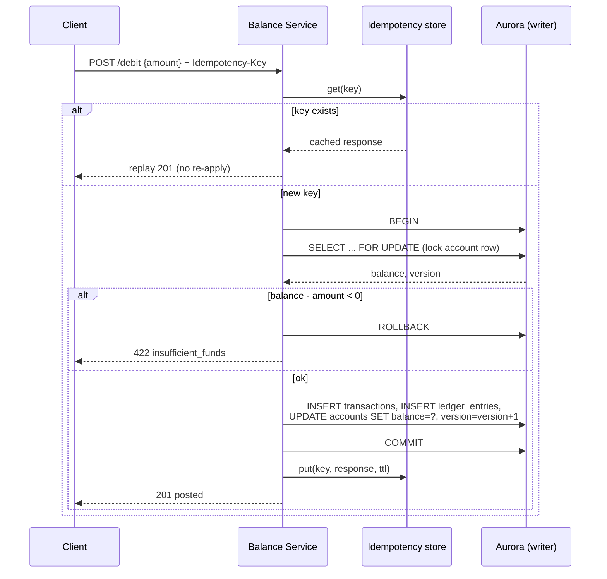
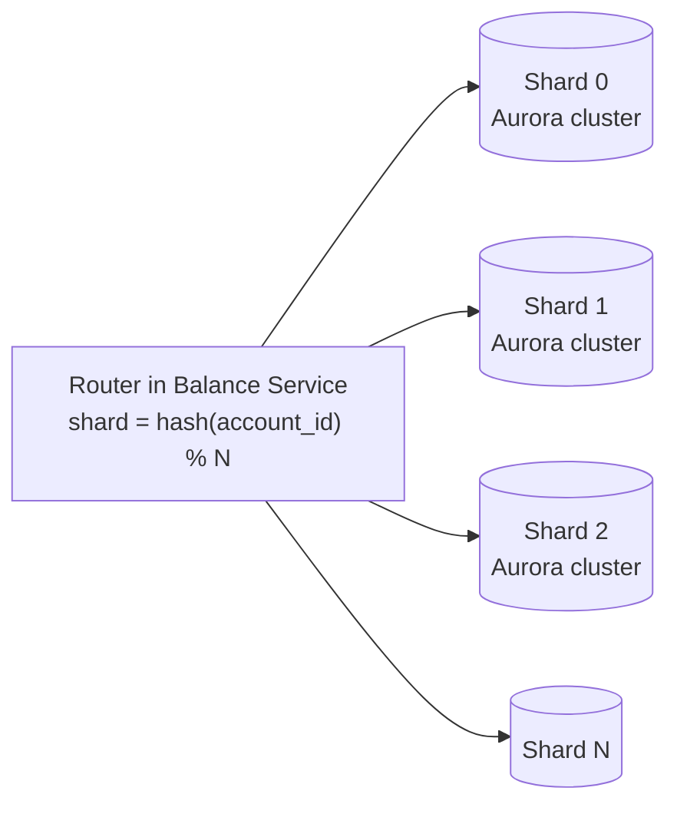

# 6. Detailed Design

This file drills into the parts that make or break correctness: the write
transaction, concurrency control, idempotency, sharding for scale, and
reconciliation/audit.

## 6.1 The write transaction (single-account: credit/debit)



The **row lock + rule check + ledger append + balance update all live in one
transaction**. Nothing outside the transaction can observe a partial state, and the
lock serializes concurrent writers to the same account.

## 6.2 Concurrency control

Two options; we use **pessimistic locking** for the write path and expose
**optimistic versioning** to clients.

| Approach | Mechanism | When |
|----------|-----------|------|
| **Pessimistic (chosen for writes)** | `SELECT … FOR UPDATE` locks the row; concurrent writers queue | Contended hot accounts; guarantees no lost update without retry loops. |
| **Optimistic** | `UPDATE … WHERE version = ?`; retry on conflict | Exposed to clients via `If-Match`; good for low contention. |

**Why pessimistic on the server:** under real contention (e.g. a popular merchant
account) optimistic retries thrash. A short row lock held for a single fast
transaction is more predictable. The lock is held only for the duration of one
in-memory rule check + a few inserts — sub-millisecond.

### Deadlock avoidance on transfers

A transfer locks **two** rows. If request 1 locks A then B, and request 2 locks B
then A, they deadlock. Fix: **always lock in a deterministic global order** (e.g.
ascending `account_id`):

```sql
-- lock both accounts in id order, regardless of transfer direction
SELECT * FROM accounts
 WHERE account_id IN (:a, :b)
 ORDER BY account_id
   FOR UPDATE;
```

With a consistent lock order, cyclic waits — and therefore deadlocks — cannot form.

## 6.3 Idempotency in depth

The idempotency key is enforced in **two** places for defense in depth:

1. **Fast path:** DynamoDB conditional `PutItem(attribute_not_exists(key))` before
   doing work — cheap early-out for the common duplicate.
2. **Durable path:** `UNIQUE(idempotency_key)` on the `transactions` table. If two
   requests race past the fast path, the DB's unique constraint rejects the second
   commit, and the service returns the first result.

This guarantees **exactly-once effect** even though the network delivers
at-least-once. The key covers the whole operation, so `{debit A 20}` retried is a
no-op, but a genuinely new `{debit A 20}` with a fresh key is a second debit — as
intended.

## 6.4 Scaling the write path: sharding

A single Aurora writer tops out around a few thousand write TPS. To reach
5,000+ TPS across 100 M accounts we **shard by `account_id`**.



- **Single-account ops** route to exactly one shard — trivially scalable.
- **Same-shard transfers** stay a single local ACID transaction — the fast common
  case if we co-locate related accounts.
- **Cross-shard transfers** can't use one local transaction. Two options:

  | Approach | How | Tradeoff |
  |----------|-----|----------|
  | **Two-phase commit (2PC)** | Coordinator prepares both shards, then commits | Strong atomicity; but blocking and fragile if the coordinator dies mid-commit. |
  | **Saga w/ reserved funds (preferred)** | Debit source (move to a `pending` hold) → credit dest → confirm; compensate on failure | Non-blocking, resilient; funds are *reserved* so no double-spend, at the cost of eventual (seconds) settlement and more states. |

  We prefer the **saga with a reserved/pending state**: the source debit places funds
  in a hold immediately (so they can't be spent twice), the destination credit is
  applied, and a failure triggers a compensating release. This keeps each shard's
  work local and ACID while making the *cross-shard* transfer eventually consistent —
  an acceptable relaxation because the money is never lost or duplicated, only
  briefly in-flight.

  > Alternatively, **Aurora Limitless / PostgreSQL partitioning** can push sharding
  > into the DB layer, but cross-shard transactional semantics carry the same
  > fundamental tradeoff.

### Managing hot accounts

Some accounts (a big merchant) are write hotspots that a single row lock
serializes. Mitigation: **balance striping** — split the hot account's balance into
K sub-balances (`account_id#0…#K`), write to a random one, and sum them on read.
Trades read simplicity for write parallelism; applied only to flagged hot accounts.

## 6.5 Auditing & reconciliation

- **Append-only ledger** is already the audit log — no row is ever mutated, so it is
  tamper-evident by construction. Corrections are compensating entries, preserving
  full history.
- **CDC to S3:** Aurora's logical replication / DMS streams committed ledger rows to
  Kinesis → Firehose → S3 (Parquet). This is the durable audit archive and offloads
  old history from the OLTP store.
- **Nightly reconciliation** (Athena/Glue job): for every account, assert
  `SUM(signed ledger_entries) == accounts.balance`. Any drift raises an alert — this
  is the safety net that catches a bug in the balance-materialization path before it
  compounds. It also verifies the global invariant `SUM(all balances) == constant`
  (money is conserved; nothing created or destroyed).

## 6.6 Reliability & failure handling

| Failure | Behavior |
|---------|----------|
| Writer AZ dies | Aurora promotes a replica (~30 s); writes 503 briefly, clients retry with the same idempotency key → no double-apply. |
| Service crashes mid-request | Uncommitted transaction rolls back; client retry is idempotent. |
| Idempotency store unavailable | Fall back to the DB `UNIQUE` constraint (still correct, slightly slower). |
| Cache down | Reads fall through to the writer; correctness unaffected, latency up. |
| CDC pipeline lag | Async audit trails behind briefly; OLTP correctness unaffected (durability came from the commit, not the stream). |

## 6.7 Summary of the core decisions

1. **ACID relational DB as source of truth** — the requirements *are* the ACID
   guarantees; buy them instead of rebuilding them on NoSQL.
2. **Append-only double-entry ledger + cached balance** — O(1) consistent reads with
   a fully auditable, reconcilable history.
3. **Pessimistic row locks with ordered acquisition** — correct, deadlock-free
   concurrency on hot accounts.
4. **Mandatory idempotency keys** — exactly-once effect over an at-least-once
   network.
5. **Shard by `account_id`; saga for cross-shard transfers** — scale writes while
   preserving no-double-spend, accepting brief eventual consistency only for the
   rare cross-shard case.
6. **Stream the ledger to S3 for audit/reconciliation** — keep OLTP small, keep the
   archive cheap and effectively unbounded.
