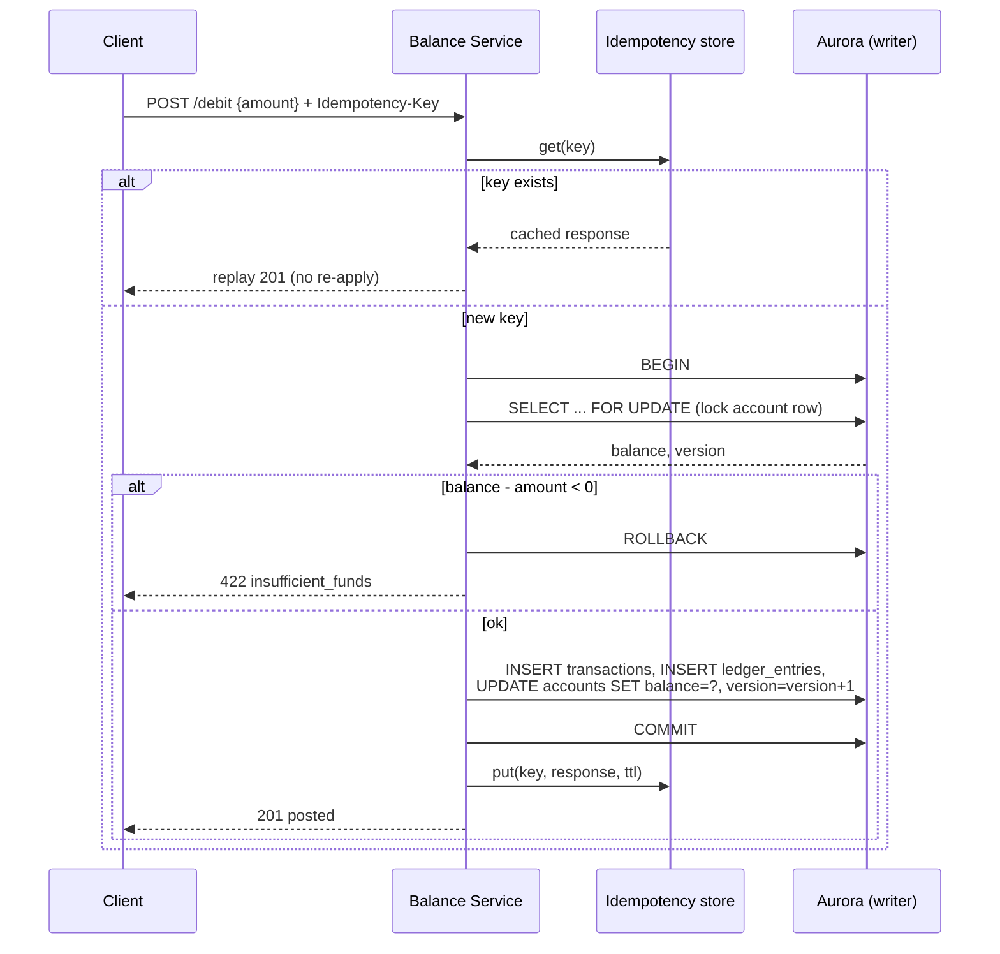
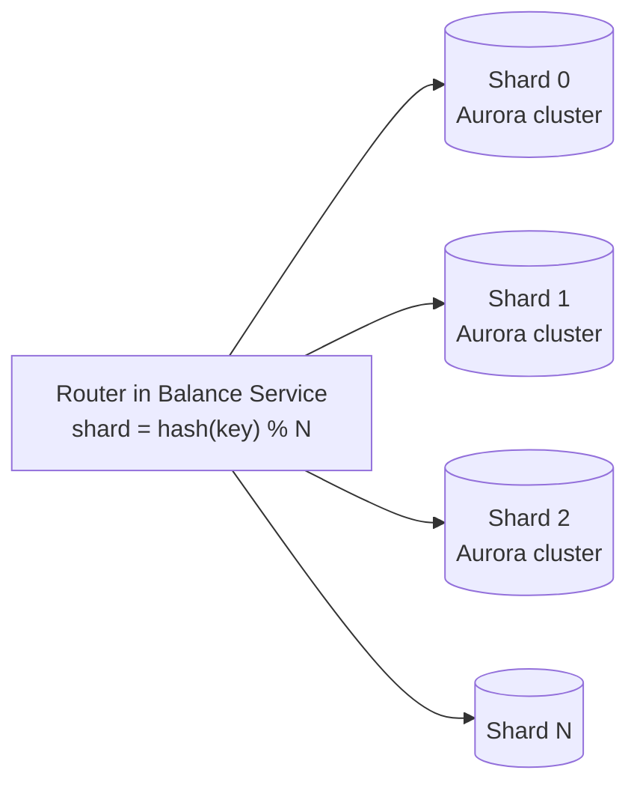
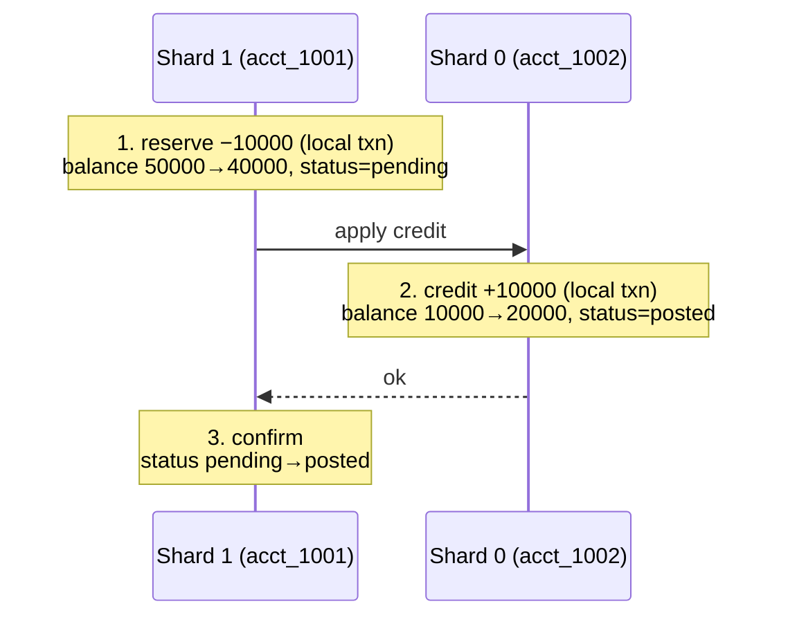

# 6. Detailed Design

This file drills into the parts that make or break correctness: the write
transaction, concurrency control, idempotency, sharding for scale, and
reconciliation/audit.

## 6.1 The write transaction (single-account: credit/debit)



The **row lock + rule check + ledger append + balance update all live in one
transaction**. Nothing outside the transaction can observe a partial state, and the
lock serializes concurrent writers to the same account.

## 6.2 Concurrency control

Two options; we use **pessimistic locking** for the write path and expose
**optimistic versioning** to clients.

| Approach | Mechanism | When |
|----------|-----------|------|
| **Pessimistic (chosen for writes)** | `SELECT … FOR UPDATE` locks the row; concurrent writers queue | Contended hot accounts; guarantees no lost update without retry loops. |
| **Optimistic** | `UPDATE … WHERE version = ?`; retry on conflict | Exposed to clients via `If-Match`; good for low contention. |

**Why pessimistic on the server:** under real contention (e.g. a popular merchant
account) optimistic retries thrash. A short row lock held for a single fast
transaction is more predictable. The lock is held only for the duration of one
in-memory rule check + a few inserts — sub-millisecond.

### Deadlock avoidance on transfers

A transfer locks **two** rows. If request 1 locks A then B, and request 2 locks B
then A, they deadlock. Fix: **always lock in a deterministic global order** (e.g.
ascending `account_id`):

```sql
-- lock both accounts in id order, regardless of transfer direction
SELECT * FROM accounts
 WHERE account_id IN (:a, :b)
 ORDER BY account_id
   FOR UPDATE;
```

With a consistent lock order, cyclic waits — and therefore deadlocks — cannot form.

## 6.3 Idempotency in depth

The idempotency key is enforced in **two** places for defense in depth:

1. **Fast path:** DynamoDB conditional `PutItem(attribute_not_exists(key))` before
   doing work — cheap early-out for the common duplicate.
2. **Durable path:** `UNIQUE(idempotency_key)` on the `transactions` table. If two
   requests race past the fast path, the DB's unique constraint rejects the second
   commit, and the service returns the first result.

This guarantees **exactly-once effect** even though the network delivers
at-least-once. The key covers the whole operation, so `{debit A 20}` retried is a
no-op, but a genuinely new `{debit A 20}` with a fresh key is a second debit — as
intended.

## 6.4 Scaling the write path: sharding

A single Aurora writer tops out around a few thousand write TPS. Reads we scale with
replicas + cache; **writes** we scale by splitting accounts across independent Aurora
clusters ("shards"), each owning a disjoint subset of accounts and committing its own
transactions in parallel. To reach 5,000+ TPS across 100 M accounts we shard by the
account's owning entity.



### The routing function

Each account maps to exactly one shard via a deterministic function of its key. With
4 shards, `shard = hash(account_id) % 4`:

| account_id | hash(…) (illustrative) | `% 4` | lives on |
|------------|------------------------|-------|----------|
| `acct_1001` | 918273 | 1 | **Shard 1** |
| `acct_1002` | 400028 | 0 | **Shard 0** |
| `acct_1003` | 771265 | 1 | **Shard 1** |
| `acct_1004` | 662310 | 2 | **Shard 2** |

Routing lives in the **stateless service layer**: it computes the shard from the
`account_id` in the request and connects to that cluster. No central lookup on the hot
path — it's pure arithmetic.

### Case 1 — single-account op (~95% of traffic, trivially scalable)

A credit/debit/balance-read touches one account → one shard → a normal local ACID
transaction. Add shards and throughput grows linearly.

```
GET  /accounts/acct_1001/balance → Shard 1  (local read)
POST /accounts/acct_1002/debit   → Shard 0  (local BEGIN…COMMIT)
```

### Case 2 — same-shard transfer (still one local transaction)

If both accounts hash to the same shard, the transfer is a single atomic transaction
— the counterparty is right there. `transfer acct_1001 → acct_1003`, both on Shard 1:

```sql
-- on Shard 1, one atomic transaction
BEGIN;
  SELECT ... FROM accounts WHERE account_id IN ('acct_1001','acct_1003')
    ORDER BY account_id FOR UPDATE;   -- lock both, ordered, deadlock-free
  INSERT transactions ...;
  INSERT ledger_entries (debit acct_1001), (credit acct_1003);
  UPDATE both balances;
COMMIT;
```

### Case 3 — cross-shard transfer (the hard case)

`transfer acct_1001 (Shard 1) → acct_1002 (Shard 0)`: the two accounts live in two
separate databases, and no single `BEGIN…COMMIT` spans two Aurora clusters. This is
the fundamental cost of sharding. Two options:

| Approach | How | Tradeoff |
|----------|-----|----------|
| **Two-phase commit (2PC)** | Coordinator prepares both shards, then commits | Strong atomicity; but **blocking** — locks held on both shards until the coordinator decides, and if it dies mid-commit the rows stay locked. |
| **Saga w/ reserved funds (preferred)** | Reserve on source → credit dest → confirm; compensate on failure | Non-blocking, resilient; funds are *reserved* so no double-spend, at the cost of eventual (seconds) settlement and more states. |

We prefer the **saga**. Walked through — start: acct_1001 = 50000, acct_1002 = 10000,
transfer 10000:



**Step 1 — reserve on the source (Shard 1, local ACID):** debit acct_1001 into a
hold; balance 50000→40000; `transactions.status = pending`. The 10000 is already
removed from the source, so it **cannot be double-spent** even though the transfer
isn't finished.

**Step 2 — apply to the destination (Shard 0, local ACID):** credit acct_1002;
balance 10000→20000; write the `txn` row `posted` (idempotently).

**Step 3 — confirm on the source (Shard 1):** flip `pending → posted`. Done. Money
conserved: −10000 on Shard 1, +10000 on Shard 0.

**If step 2 fails → compensate.** Run a compensating transaction on Shard 1 to release
the hold: credit acct_1001 back to 50000, append a **reversal** ledger entry (never
delete the original — append-only), set `status = reversed`. The audit trail shows the
full story: reserved, then reversed.

The saga trades **strong atomicity for non-blocking resilience**. The safety property
holds regardless: because the source is debited *first* into a hold, the money is
never spent twice — worst case it is briefly `pending` (seconds) before it settles or
reverses.

> Aurora Limitless / PostgreSQL partitioning can push sharding into the DB layer, but
> cross-shard transactional semantics carry the same fundamental tradeoff.

### Choosing the shard key: co-locate related accounts

Cross-shard transfers are the expensive case, so pick a key that minimizes them.
Sharding by raw `account_id` can put a customer's checking and savings on different
shards, making an internal savings→checking move cross-shard. Instead shard by
**customer/entity id** so all of one customer's accounts co-locate:

```
shard = hash(customer_id) % N   -- all of Alice's accounts on the same shard
```

Now Alice moving money between her own accounts stays a single local ACID transaction;
only transfers between *different customers* risk being cross-shard.

### Hot accounts — balance striping

Sharding spreads *different* accounts across clusters but doesn't help a single
super-hot account (a big merchant taking 2,000 payments/sec): every write contends on
the **same row lock** on one shard. Fix: split that account's balance into **K
stripes**, each a separate row:

```
merchant_42#0 … merchant_42#K-1     -- K rows, K independent locks
```

- **Write:** pick a random stripe → lock only that row → K× the write parallelism.
- **Read balance:** `SELECT SUM(balance) FROM accounts WHERE account_id LIKE 'merchant_42#%'`.

Example: 4 concurrent credits landing on stripes #2, #0, #2, #3 update three rows in
parallel instead of serializing on one. Trade-off: reads sum K rows; applied only to
accounts *flagged* as hot, so normal accounts don't pay the complexity.

### Resharding

`hash % N` has a nasty property: change `N` and almost every account remaps (4→5
shards reshuffles ~80% of keys), implying huge data migration. Mitigations:

- **Consistent hashing / fixed logical buckets:** map accounts to a large fixed number
  of buckets (e.g. 4096), then assign buckets to physical shards. Adding a shard moves
  a *few buckets*, not the whole keyspace.
- **Range/directory sharding:** a lookup table maps account ranges → shards, so a hot
  range can be split surgically at the cost of a directory lookup.

The design uses fixed logical buckets so adding capacity moves a bounded slice of data.

### Summary of sharding cases

| Case | Handling | Cost |
|------|----------|------|
| Single-account op (~95%) | Route to one shard, local ACID | None — scales linearly |
| Same-shard transfer | One local ACID transaction | None |
| Cross-shard transfer | Saga: reserve → credit → confirm, compensate on failure | Eventual consistency (seconds), more states |
| Hot single account | Balance striping across K rows | Reads sum K rows |
| Adding capacity | Logical buckets / consistent hashing | Bounded data movement |

The strategy rests on one bet: **the vast majority of operations touch a single
account (or a single customer's accounts), so they stay local and ACID; only genuine
cross-customer transfers pay the distributed-transaction tax, and we make those safe
(never double-spend) rather than strongly atomic.**

## 6.5 Auditing & reconciliation

- **Append-only ledger** is already the audit log — no row is ever mutated, so it is
  tamper-evident by construction. Corrections are compensating entries, preserving
  full history.
- **CDC to S3:** Aurora's logical replication / DMS streams committed ledger rows to
  Kinesis → Firehose → S3 (Parquet). This is the durable audit archive and offloads
  old history from the OLTP store.
- **Nightly reconciliation** (Athena/Glue job): for every account, assert
  `SUM(signed ledger_entries) == accounts.balance`. Any drift raises an alert — this
  is the safety net that catches a bug in the balance-materialization path before it
  compounds. It also verifies the global invariant `SUM(all balances) == constant`
  (money is conserved; nothing created or destroyed).

## 6.6 Reliability & failure handling

| Failure | Behavior |
|---------|----------|
| Writer AZ dies | Aurora promotes a replica (~30 s); writes 503 briefly, clients retry with the same idempotency key → no double-apply. |
| Service crashes mid-request | Uncommitted transaction rolls back; client retry is idempotent. |
| Idempotency store unavailable | Fall back to the DB `UNIQUE` constraint (still correct, slightly slower). |
| Cache down | Reads fall through to the writer; correctness unaffected, latency up. |
| CDC pipeline lag | Async audit trails behind briefly; OLTP correctness unaffected (durability came from the commit, not the stream). |

## 6.7 Summary of the core decisions

1. **ACID relational DB as source of truth** — the requirements *are* the ACID
   guarantees; buy them instead of rebuilding them on NoSQL.
2. **Append-only double-entry ledger + cached balance** — O(1) consistent reads with
   a fully auditable, reconcilable history.
3. **Pessimistic row locks with ordered acquisition** — correct, deadlock-free
   concurrency on hot accounts.
4. **Mandatory idempotency keys** — exactly-once effect over an at-least-once
   network.
5. **Shard by customer/entity id; saga for cross-shard transfers** — scale writes
   while preserving no-double-spend, co-locating a customer's accounts and accepting
   brief eventual consistency only for the rare cross-customer case.
6. **Stream the ledger to S3 for audit/reconciliation** — keep OLTP small, keep the
   archive cheap and effectively unbounded.
