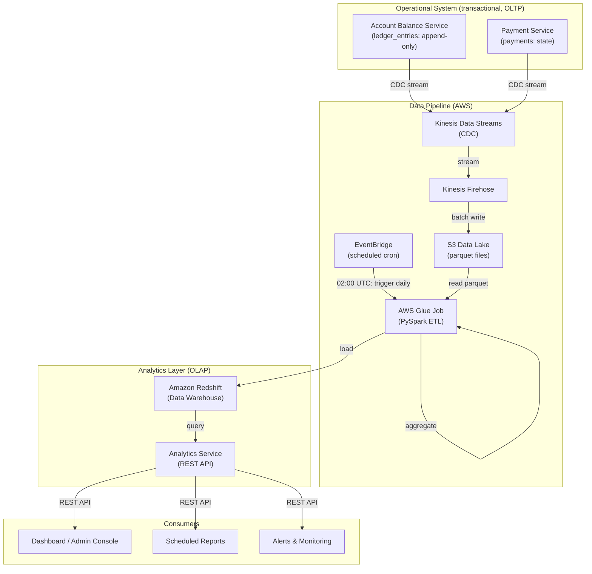

# Analytics Service: Daily, Weekly, and Monthly Statistics

## Overview

A dedicated **Analytics Service** provides reporting on payment volume, success rates, customer behavior, and platform health. It separates analytical queries from the transactional payment system, ensuring analytics don't degrade payment processing performance.

## The Problem

Running aggregation queries directly on the operational database causes issues:

```sql
-- This kills OLTP performance
SELECT 
    DATE_TRUNC('day', created_at) as day,
    COUNT(*) as txn_count,
    SUM(amount) as total_volume
FROM ledger_entries
WHERE created_at > NOW() - INTERVAL '30 days'
GROUP BY DATE_TRUNC('day', created_at);
```

- **Full table scans** over millions of rows
- **Locks rows**, blocks real payments
- **Latency spikes** for customers
- **Resource contention** between OLTP and OLAP workloads

**Solution:** Separate analytics into a dedicated data warehouse with pre-aggregated tables.

## Architecture



## AWS Services for ETL Pipeline

### Service Selection

| Service | Role | Why this choice |
|---------|------|-----------------|
| **Kinesis Data Streams** | Capture real-time data from operational DB (existing) | Already streaming ledger/payment events; decouples OLTP from analytics. |
| **Kinesis Firehose** | Buffer and batch data to S3 (existing) | Automatic batching, compression, retry logic; no server management. |
| **S3 Data Lake** | Store raw and processed data (existing) | Cheap, durable, integrates with all AWS analytics tools. |
| **EventBridge** | Schedule and trigger ETL jobs | Cron-based scheduling; triggers Glue jobs at precise times (daily 02:00, weekly Monday 03:00, monthly 1st 03:30). |
| **AWS Glue** | Execute ETL transformations | Managed Apache Spark; scales automatically; integrates natively with S3 and Redshift; pay per DPU-hour. |
| **Amazon Redshift** | Data warehouse for analytics | Columnar storage optimized for analytical queries; petabyte scale; supports complex joins and aggregations. |

### Architecture Notes

- **CDC → Kinesis → Firehose → S3** (existing pipeline) delivers raw parquet files to the data lake every few minutes
- **EventBridge Cron Rules** trigger Glue jobs on schedules:
  - Daily: 02:00 UTC (after ledger activity cools)
  - Weekly: Monday 03:00 UTC (aggregate 7 days of daily stats)
  - Monthly: 1st at 03:30 UTC (aggregate entire month)
- **Glue Jobs** run PySpark transformations:
  - Read partitioned parquet from S3
  - Group, aggregate, compute percentiles
  - Write to Redshift (append mode with deduplication)
- **Redshift** stores pre-aggregated tables:
  - `daily_payment_stats` (365 rows/account/year)
  - `weekly_payment_stats` (52 rows/account/year)
  - `monthly_payment_stats` (12 rows/account/year)
  - Queries return results in <100ms

### Cost Estimation (Monthly)

```
AWS Glue:
  - Daily job: 2 DPU × 1 hr × $0.44/DPU-hr × 30 days = $26.40
  - Weekly job: 2 DPU × 1.5 hr × $0.44/DPU-hr × 4 weeks = $5.28
  - Monthly job: 2 DPU × 2 hr × $0.44/DPU-hr × 1/month = $1.76
  Subtotal: $33.44

Kinesis Firehose:
  - ~100 GB/month of ledger data × $0.029/GB = $2.90

Amazon Redshift:
  - Dense Compute dc2.large (2-node): $0.25/hr × 730 hrs = $182.50
  - Subtotal: $182.50

EventBridge:
  - 30 rules × $1/month = $30
  - Invocations: negligible

Total: ~$250/month for analytics layer
```

### Scaling Considerations

| Data Volume | Recommendation |
|-------------|---|
| < 10 GB/day | Reduce Glue DPU to 1, use dc2.large Redshift single-node |
| 10–100 GB/day | 2 DPU Glue, 2-node Redshift dc2.large (current setup) |
| 100–500 GB/day | 4 DPU Glue, 4-node Redshift dc2.large or ra3.xlplus |
| 500 GB+ / day | Consider Redshift Spectrum (query S3 directly) or Snowflake |

---

## Data Flow

### 1. Events flow to S3 (existing CDC pipeline)

Ledger entries and payment state changes are already streamed via Kinesis to S3:

```
ledger_entries → Kinesis Data Streams → Kinesis Firehose → S3
payments → Kinesis Data Streams → Kinesis Firehose → S3
```

S3 structure:
```
s3://data-lake/
  ledger_entries/
    date=2026-07-09/
      hour=12/
        [parquet files]
  payments/
    date=2026-07-09/
      hour=12/
        [parquet files]
```

### 2. ETL job aggregates nightly

```python
# Runs at 02:00 UTC daily for the previous day
def etl_daily_stats(date: str):
    # Extract from S3
    ledger_data = read_s3_parquet(f"s3://data-lake/ledger_entries/date={date}/")
    payments_data = read_s3_parquet(f"s3://data-lake/payments/date={date}/")
    
    # Transform: aggregate by account, day
    daily_stats = ledger_data.groupby('account_id').agg(...)
    
    # Load to warehouse
    warehouse.insert("daily_payment_stats", daily_stats)
```

### 3. Weekly/monthly aggregates cascade

```python
# Weekly: aggregate daily stats (runs Mondays at 03:00)
def etl_weekly_stats(week_start: str):
    daily = warehouse.query(f"""
        SELECT * FROM daily_payment_stats
        WHERE stat_date >= {week_start}
          AND stat_date < {week_start} + INTERVAL 7 DAY
    """)
    weekly_agg = daily.groupby(...).sum()
    warehouse.insert("weekly_payment_stats", weekly_agg)

# Monthly: aggregate daily stats (runs 1st of month at 03:30)
def etl_monthly_stats(month_start: str):
    daily = warehouse.query(f"""
        SELECT * FROM daily_payment_stats
        WHERE DATE_TRUNC('month', stat_date) = {month_start}
    """)
    monthly_agg = daily.groupby(...).sum()
    warehouse.insert("monthly_payment_stats", monthly_agg)
```

### 4. Analytics Service queries the warehouse

```python
@app.get("/v1/stats/daily")
def get_daily_stats(account_id: str, start_date: str, end_date: str):
    """
    Fetch pre-aggregated daily stats for a customer.
    Fast: O(1) lookup, no full table scans.
    """
    result = warehouse.query(f"""
        SELECT stat_date, payment_count, total_volume, success_rate
        FROM daily_payment_stats
        WHERE account_id = %s
          AND stat_date BETWEEN %s AND %s
        ORDER BY stat_date ASC
    """, (account_id, start_date, end_date))
    return result
```

## Data Warehouse Schema

### `daily_payment_stats`

Pre-aggregated daily statistics per account.

| Column | Type | Notes |
|--------|------|-------|
| `stat_date` | DATE | PK. The day being aggregated. |
| `account_id` | UUID | PK. Which account. |
| `payment_count` | INT | Number of payments. |
| `total_volume` | BIGINT | Sum of all amounts (cents). |
| `avg_payment` | BIGINT | Average payment size. |
| `median_payment` | BIGINT | 50th percentile. |
| `min_payment` | BIGINT | Smallest payment. |
| `max_payment` | BIGINT | Largest payment. |
| `p95_payment` | BIGINT | 95th percentile (for spike detection). |
| `success_count` | INT | Posted payments. |
| `failed_count` | INT | Failed payments. |
| `success_rate` | DECIMAL | Percentage (0.0–100.0). |
| `pending_count` | INT | Still pending (rare at end of day). |
| `avg_days_to_settle` | DECIMAL | For external payments. |
| `third_party_failures` | INT | Failures from third party (not our system). |
| `loaded_at` | TIMESTAMPTZ | When this row was computed. |

Indexes:
- `PRIMARY KEY (stat_date, account_id)`
- `INDEX (stat_date)` — platform-wide queries
- `INDEX (account_id, stat_date DESC)` — customer dashboard

### `weekly_payment_stats`

Aggregated from daily, one row per account per week.

| Column | Type | Notes |
|--------|------|-------|
| `week_start_date` | DATE | PK. Monday of that week. |
| `account_id` | UUID | PK. |
| `payment_count` | INT | Sum of daily counts. |
| `total_volume` | BIGINT | Sum of daily volumes. |
| `avg_payment` | BIGINT | Average across the week. |
| `success_count` | INT | Total successful. |
| `failed_count` | INT | Total failed. |
| `success_rate` | DECIMAL | (success / total). |
| `... (other dimensions)` | | |
| `loaded_at` | TIMESTAMPTZ | |

Indexes:
- `PRIMARY KEY (week_start_date, account_id)`
- `INDEX (week_start_date)`

### `monthly_payment_stats`

Aggregated from daily/weekly, one row per account per month.

| Column | Type | Notes |
|--------|------|-------|
| `month_start_date` | DATE | PK. 1st of the month. |
| `account_id` | UUID | PK. |
| `payment_count` | INT | Sum of daily counts. |
| `total_volume` | BIGINT | Sum for the month. |
| `avg_payment` | BIGINT | |
| `success_rate` | DECIMAL | |
| `... (same as weekly)` | | |

### `platform_stats` (optional, for system-wide metrics)

One row per day, aggregated across all accounts.

| Column | Type | Notes |
|--------|------|-------|
| `stat_date` | DATE | PK. |
| `total_payments` | INT | All payments across platform. |
| `total_volume` | BIGINT | All money moved. |
| `unique_accounts` | INT | Active accounts. |
| `avg_payment` | BIGINT | Average across all. |
| `success_rate` | DECIMAL | Platform success rate. |
| `p95_payment_size` | BIGINT | 95th percentile for spike detection. |

## Analytics Service API

### Daily Statistics

```
GET /v1/stats/daily
Query parameters:
  account_id (required): UUID of customer
  start_date (required): YYYY-MM-DD
  end_date (required): YYYY-MM-DD

Response:
{
  "account_id": "...",
  "period": { "start": "2026-07-01", "end": "2026-07-31" },
  "data": [
    {
      "date": "2026-07-01",
      "payment_count": 5,
      "total_volume": 125000,
      "avg_payment": 25000,
      "success_count": 4,
      "failed_count": 1,
      "success_rate": 80.0
    },
    ...
  ]
}
```

### Weekly Statistics

```
GET /v1/stats/weekly
Query parameters:
  account_id (required): UUID
  start_week (optional): YYYY-MM-DD (Monday)
  end_week (optional): YYYY-MM-DD (Monday)

Response: similar to daily, but aggregated by week
```

### Monthly Statistics

```
GET /v1/stats/monthly
Query parameters:
  account_id (required): UUID
  start_month (optional): YYYY-MM (e.g., 2026-07)
  end_month (optional): YYYY-MM

Response: similar to daily, but aggregated by month
```

### Platform-Wide Statistics

```
GET /v1/stats/platform/daily
Query parameters:
  date (required): YYYY-MM-DD

Response:
{
  "date": "2026-07-09",
  "total_payments": 50000,
  "total_volume": 1250000000,
  "unique_accounts": 25000,
  "avg_payment": 25000,
  "success_rate": 98.5,
  "p95_payment_size": 100000
}
```

### Trends

```
GET /v1/stats/trends
Query parameters:
  granularity: "daily" | "weekly" | "monthly" (default: daily)
  days_back: integer (default: 90)

Response:
{
  "granularity": "daily",
  "data": [
    {
      "period": "2026-07-09",
      "total_payments": 50000,
      "total_volume": 1250000000,
      "success_rate": 98.5
    },
    ...
  ]
}
```

## Implementation

### ETL Job Code

```python
# analytics/etl.py
from datetime import datetime, timedelta
import pandas as pd
import pyarrow.parquet as pq

class PaymentStatsETL:
    def __init__(self, s3_client, warehouse_client):
        self.s3 = s3_client
        self.warehouse = warehouse_client
    
    def run_daily(self, date: str):
        """
        Aggregate ledger and payment data for a single day.
        Called nightly at 02:00 for previous day.
        """
        target_date = datetime.fromisoformat(date)
        
        # Step 1: Extract
        print(f"Extracting data for {date}...")
        ledger_df = self._read_s3_parquet(
            f"s3://data-lake/ledger_entries/date={date}/"
        )
        payments_df = self._read_s3_parquet(
            f"s3://data-lake/payments/date={date}/"
        )
        
        # Step 2: Transform
        print("Transforming...")
        daily_stats = self._aggregate_daily(ledger_df, payments_df, target_date)
        
        # Step 3: Load
        print("Loading to warehouse...")
        self.warehouse.insert_table('daily_payment_stats', daily_stats)
        print(f"Loaded {len(daily_stats)} rows")
    
    def _aggregate_daily(self, ledger_df, payments_df, date):
        """
        Aggregate ledger entries and payment states by account and day.
        """
        # Filter to target date
        ledger_df = ledger_df[
            (ledger_df['created_at'] >= date) &
            (ledger_df['created_at'] < date + timedelta(days=1))
        ]
        payments_df = payments_df[
            (payments_df['created_at'] >= date) &
            (payments_df['created_at'] < date + timedelta(days=1))
        ]
        
        # Aggregate ledger by account
        ledger_agg = ledger_df.groupby('account_id').agg({
            'amount': ['sum', 'count', 'mean', 'median', 'min', 'max'],
            'transaction_id': 'nunique'  # unique transactions
        }).reset_index()
        ledger_agg.columns = [
            'account_id', 'total_volume', 'payment_count', 'avg_payment',
            'median_payment', 'min_payment', 'max_payment', 'unique_txns'
        ]
        
        # P95 (95th percentile)
        ledger_agg['p95_payment'] = ledger_df.groupby('account_id')[
            'amount'
        ].quantile(0.95).reset_index(drop=True)
        
        # Aggregate payments by status
        payment_status = payments_df.groupby(['account_id', 'status']).agg({
            'payment_id': 'count'
        }).unstack(fill_value=0).reset_index()
        payment_status.columns = payment_status.columns.get_level_values(1)
        payment_status.rename(columns={'': 'account_id'}, inplace=True)
        
        # Merge
        result = ledger_agg.merge(payment_status, on='account_id', how='left')
        result['stat_date'] = date.date()
        result['success_rate'] = (
            result.get('posted', 0) / (result['payment_count']) * 100
        ).round(2)
        result['loaded_at'] = datetime.now()
        
        return result
    
    def run_weekly(self, week_start: str):
        """
        Aggregate daily stats into weekly buckets.
        Called every Monday at 03:00.
        """
        week_start_date = datetime.fromisoformat(week_start).date()
        week_end_date = week_start_date + timedelta(days=7)
        
        print(f"Aggregating weekly stats for week starting {week_start}...")
        
        daily_stats = self.warehouse.query(f"""
            SELECT *
            FROM daily_payment_stats
            WHERE stat_date >= %s AND stat_date < %s
        """, (week_start_date, week_end_date))
        
        weekly_agg = daily_stats.groupby('account_id').agg({
            'payment_count': 'sum',
            'total_volume': 'sum',
            'avg_payment': 'mean',
            'success_count': 'sum',
            'failed_count': 'sum',
        }).reset_index()
        
        weekly_agg['week_start_date'] = week_start_date
        weekly_agg['success_rate'] = (
            weekly_agg['success_count'] / (
                weekly_agg['success_count'] + weekly_agg['failed_count']
            ) * 100
        ).round(2)
        weekly_agg['loaded_at'] = datetime.now()
        
        self.warehouse.insert_table('weekly_payment_stats', weekly_agg)
        print(f"Loaded {len(weekly_agg)} weekly aggregates")
    
    def run_monthly(self, month_start: str):
        """
        Aggregate daily stats into monthly buckets.
        Called on the 1st at 03:30.
        """
        month_start_date = datetime.fromisoformat(month_start).date()
        # Calculate next month
        if month_start_date.month == 12:
            month_end_date = month_start_date.replace(year=month_start_date.year + 1, month=1)
        else:
            month_end_date = month_start_date.replace(month=month_start_date.month + 1)
        
        print(f"Aggregating monthly stats for {month_start}...")
        
        daily_stats = self.warehouse.query(f"""
            SELECT *
            FROM daily_payment_stats
            WHERE stat_date >= %s AND stat_date < %s
        """, (month_start_date, month_end_date))
        
        monthly_agg = daily_stats.groupby('account_id').agg({
            'payment_count': 'sum',
            'total_volume': 'sum',
            'avg_payment': 'mean',
            'success_count': 'sum',
            'failed_count': 'sum',
        }).reset_index()
        
        monthly_agg['month_start_date'] = month_start_date
        monthly_agg['success_rate'] = (
            monthly_agg['success_count'] / (
                monthly_agg['success_count'] + monthly_agg['failed_count']
            ) * 100
        ).round(2)
        monthly_agg['loaded_at'] = datetime.now()
        
        self.warehouse.insert_table('monthly_payment_stats', monthly_agg)
        print(f"Loaded {len(monthly_agg)} monthly aggregates")
    
    def _read_s3_parquet(self, s3_path: str):
        """Read parquet files from S3 path (may be multiple files)."""
        return pd.read_parquet(s3_path, engine='pyarrow')

# Scheduling
import schedule
import time

if __name__ == "__main__":
    etl = PaymentStatsETL(s3_client, warehouse_client)
    
    # Daily: 02:00 UTC
    schedule.every().day.at("02:00").do(
        etl.run_daily,
        date=(datetime.now() - timedelta(days=1)).isoformat()
    )
    
    # Weekly: every Monday at 03:00 UTC
    schedule.every().monday.at("03:00").do(
        etl.run_weekly,
        week_start=(
            datetime.now() - timedelta(days=datetime.now().weekday())
        ).isoformat()
    )
    
    # Monthly: 1st of month at 03:30 UTC
    schedule.every().day.at("03:30").do(etl.run_monthly)
    
    while True:
        schedule.run_pending()
        time.sleep(60)
```

### Analytics Service API

```python
# analytics/api.py
from flask import Flask, request, jsonify
import datetime

app = Flask(__name__)

@app.get("/v1/stats/daily")
def get_daily_stats():
    account_id = request.args.get('account_id')
    start_date = request.args.get('start_date')
    end_date = request.args.get('end_date')
    
    if not all([account_id, start_date, end_date]):
        return jsonify({"error": "Missing required parameters"}), 400
    
    result = warehouse.query(f"""
        SELECT 
            stat_date,
            payment_count,
            total_volume,
            avg_payment,
            median_payment,
            min_payment,
            max_payment,
            success_count,
            failed_count,
            success_rate
        FROM daily_payment_stats
        WHERE account_id = %s
          AND stat_date >= %s
          AND stat_date <= %s
        ORDER BY stat_date ASC
    """, (account_id, start_date, end_date))
    
    return jsonify({
        "account_id": account_id,
        "period": {"start": start_date, "end": end_date},
        "data": result.to_dict('records')
    })

@app.get("/v1/stats/platform/daily")
def get_platform_daily():
    date = request.args.get('date')
    
    if not date:
        return jsonify({"error": "date parameter required"}), 400
    
    result = warehouse.query(f"""
        SELECT 
            SUM(payment_count) as total_payments,
            SUM(total_volume) as total_volume,
            COUNT(DISTINCT account_id) as unique_accounts,
            AVG(avg_payment) as avg_payment_size,
            ROUND(AVG(success_rate), 2) as success_rate
        FROM daily_payment_stats
        WHERE stat_date = %s
    """, (date,))
    
    return jsonify(result.to_dict('records')[0] if result else {})

@app.get("/v1/stats/trends")
def get_trends():
    granularity = request.args.get('granularity', 'daily')
    days_back = int(request.args.get('days_back', 90))
    
    table = f"{granularity}_payment_stats"
    date_col = {
        'daily': 'stat_date',
        'weekly': 'week_start_date',
        'monthly': 'month_start_date'
    }[granularity]
    
    result = warehouse.query(f"""
        SELECT 
            {date_col} as period,
            SUM(payment_count) as total_payments,
            SUM(total_volume) as total_volume,
            AVG(avg_payment) as avg_payment,
            ROUND(AVG(success_rate), 2) as success_rate
        FROM {table}
        WHERE {date_col} >= CURRENT_DATE - INTERVAL {days_back} DAY
        GROUP BY {date_col}
        ORDER BY {date_col} DESC
    """)
    
    return jsonify({
        "granularity": granularity,
        "data": result.to_dict('records')
    })

if __name__ == "__main__":
    app.run(port=8003, debug=False)
```

## Example Queries

### High-value customers in July

```sql
SELECT account_id, SUM(total_volume) as monthly_volume
FROM monthly_payment_stats
WHERE month_start_date = '2026-07-01'
GROUP BY account_id
HAVING SUM(total_volume) > 1000000
ORDER BY monthly_volume DESC
LIMIT 100;
```

### Payment success rate trend

```sql
SELECT 
    stat_date,
    ROUND(success_rate, 1) as success_rate,
    payment_count
FROM daily_payment_stats
WHERE stat_date >= CURRENT_DATE - 30
ORDER BY stat_date DESC;
```

### Spike detection (unusual payment sizes)

```sql
SELECT 
    stat_date,
    account_id,
    max_payment,
    p95_payment,
    CASE 
        WHEN max_payment > p95_payment * 3 THEN 'SPIKE'
        ELSE 'NORMAL'
    END as anomaly
FROM daily_payment_stats
WHERE stat_date = CURRENT_DATE - 1
  AND max_payment > p95_payment * 3;
```

### Churn detection (inactive accounts)

```sql
SELECT 
    account_id,
    MAX(stat_date) as last_payment_date,
    CURRENT_DATE - MAX(stat_date) as days_since_payment
FROM daily_payment_stats
GROUP BY account_id
HAVING CURRENT_DATE - MAX(stat_date) > 30
ORDER BY last_payment_date ASC;
```

## Monitoring & Alerting

```python
# Monitor ETL health
alerts = {
    "etl_delayed": "ETL job hasn't completed by 04:00 UTC",
    "etl_failed": "ETL job failed (check logs)",
    "outbox_depth": "Outbox has >1000 unpublished events (ETL is slow)",
    "warehouse_latency": "Query latency >5 seconds",
}

# Monitor data quality
data_quality_checks = [
    "payment_count matches ledger_entries count",
    "total_volume sums correctly",
    "success_rate is between 0 and 100",
    "no null values in key columns",
]
```

## Scaling Considerations

| Milestone | Data Size | Action |
|-----------|-----------|--------|
| **1M payments/month** | ~100 MB daily | Start with basic aggregates. |
| **10M payments/month** | ~1 GB daily | Add hourly snapshots, real-time dashboards. |
| **100M+ payments/month** | ~10 GB daily | Partition warehouse tables, add data marts, use columnar compression. |

## Integration with Payment Service

The Payment Service **doesn't change**. It continues:
1. Recording payments in the `payments` table
2. Appending to `ledger_entries`
3. Publishing events to Kinesis/S3 (existing CDC)

The Analytics Service **consumes** this data:
1. Reads parquet files from S3 (already flowing there)
2. Runs ETL jobs to aggregate
3. Stores in warehouse
4. Serves queries via REST API

## When to Build This

- **Early (<1M payments/month)**: Skip it. Query ledger directly.
- **Growth (1–10M/month)**: Start building. Manual aggregation is fine.
- **Scale (10M+/month)**: Essential. Operational DB can't handle analytics queries.

## Key Takeaways

1. **Separate OLTP from OLAP** — operational database for transactions, warehouse for analytics.
2. **Pre-aggregate** — compute daily/weekly/monthly once, query many times.
3. **Reuse CDC pipeline** — data already flows to S3; ETL just consumes it.
4. **Stateless services** — Analytics Service has no state; queries can be replayed from warehouse.
5. **Operational isolation** — analytics queries never impact payment processing.
