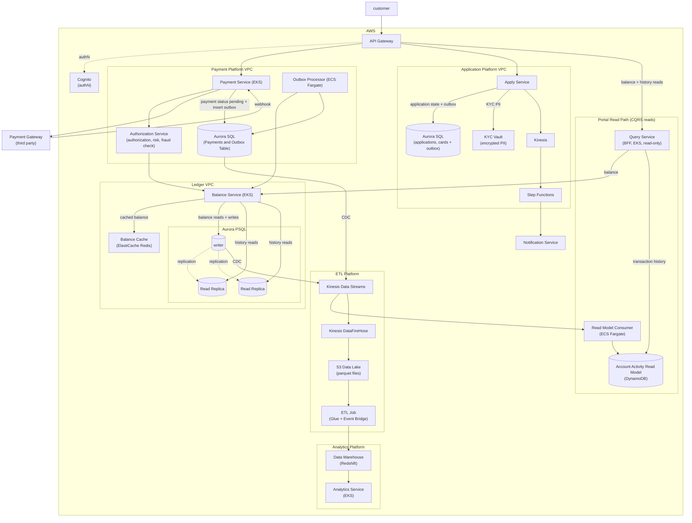

# Banking Platform

A reduced version of the online banking platform taking elements from the account balance service, online banking platform
and virtual credit card.

## Requirements

1. Apply for cards
2. Manage payments including using third party payment service
3. Payment Authorization
4. Support calculating daily, weekly and monthly statistics

## High Level Diagram


---
## Storage Schema

Simplified storage schema for databases, only key columns are included

### Balance Service DB (Ledger)

This is the DB that contains the ledger — the **source of truth for balances**. It uses double-entry
bookkeeping: every money movement is a `ledger_transaction` made up of two or more balanced
`ledger_entries`. Not every entry comes from a payment (interest, fees, adjustments, chargebacks all
originate here), which is why this is a separate database from Payments — see
[Payments vs. Ledger](#payments-vs-ledger-why-two-databases).

Tables:

**ledger_transactions**

Groups the entries that make up a single balanced money movement.

| Column | Type | Notes |
|--------|------|-------|
| `transaction_id` | UUID | PK. Generated by the Balance Service. |
| `source_payment_id` | UUID | **Nullable.** FK reference to `payments.payment_id`. `NULL` for ledger-originated movements (interest, fees, adjustments). |
| `reason` | ENUM | `payment`, `fee`, `interest`, `adjustment`, `reversal`. |
| `created_at` | TIMESTAMP | |

**Invariant:** the entries of a single `transaction_id` must **sum to zero** (Σ debits = Σ credits).
This is the property that makes it a real double-entry ledger, and the payments table cannot enforce it.

**ledger_entries**

| Column | Type | Notes |
|--------|------|-------|
| `entry_id` | UUID | PK. |
| `transaction_id` | UUID | FK → `ledger_transactions`. |
| `account_id` | UUID | FK → `accounts`. Shard key. |
| `direction` | ENUM | `debit` or `credit`. |
| `amount` | BIGINT | Minor units, always **positive**; `direction` carries the sign. |

**accounts**

| Column | Type | Notes |
|--------|------|-------|
| `account_id` | UUID | PK. Also the shard key. |
| `balance` | BIGINT | **Minor units (cents).** Cached materialization of the ledger. |
| `version` | BIGINT | Optimistic-lock / row version, bumped on every mutation. |


### Payment DB

Tracks the **lifecycle of moving money through external rails** (the payment gateway / card network).
A payment records intent and status; a failed or declined payment is a valid row here that **never
touches the ledger**. One payment maps to at most one `ledger_transaction` (via `source_payment_id`).

**payments**

| Column | Type | Notes |
|--------|------|-------|
| `payment_id` | UUID | PK. |
| `type` | ENUM | `credit`, `debit`, `transfer`. |
| `status` | ENUM | `pending`, `posted`, `failed`, `reversed`. |
| `idempotency_key` | VARCHAR | **Unique.** Dedupes client retries. |
| `gateway_ref` | VARCHAR | Reference ID returned by the third-party gateway. |

**outbox**

Written atomically with `payments` in the same local transaction (see [Outbox Pattern](#outbox-pattern)).

| Column | Type | Notes |
|--------|------|-------|
| `event_id` | UUID | PK. |
| `event_type` | VARCHAR | e.g. `payment.settled`. |
| `payload` | JSONB | `{ payment_id, account_id, amount }`. |
| `idempotency_key` | VARCHAR | Passed to the Balance Service for dedupe. |
| `published` | BOOLEAN | `False` until the Outbox Processor confirms the ledger applied it. |
| `retry_count` | INT | Incremented on failed delivery. |

### Apply Service DB

Stores the card-application lifecycle (driven by Step Functions) plus provisioned cards. Sensitive KYC PII
lives in a separate encrypted **KYC Vault**, referenced by pointer — the high-churn tables stay free of
crown-jewel data. On approval, the funding account is created in the ledger `accounts` table.

**applications**

| Column | Type | Notes |
|--------|------|-------|
| `application_id` | UUID | PK. |
| `status` | ENUM | `submitted`, `identity_check`, `credit_check`, `approved`, `declined`. |
| `kyc_ref` | VARCHAR | **Pointer** to KYC Vault — not the PII itself. |

**cards** (provisioned on approval)

| Column | Type | Notes |
|--------|------|-------|
| `card_id` | UUID | PK. |
| `account_id` | UUID | FK → ledger `accounts`. |
| `pan_token` | VARCHAR | **Tokenized** PAN / vault reference — never the raw number. CVV never stored. |
| `status` | ENUM | `active`, `frozen`, `closed`. |

An **outbox** table (same shape as the Payment DB) carries the `application.approved` event so account/card
provisioning is a consistent downstream write rather than a risky dual write.

---

### Payments vs. Ledger (why two databases)

`payments.payment_id` and `ledger_entries.transaction_id` are **different concepts that were both once
called "transaction"** — the source of most confusion here.

| | Payment | Ledger transaction |
|--|---------|--------------------|
| **Owns** | Payment Service | Balance Service |
| **Represents** | Instruction moving through external rails | Accounting truth (double-entry) |
| **Grain** | One instruction | One balanced set of 2+ entries |
| **Failed/declined case** | Real row, `status=failed` | No row at all |
| **No-payment case** | n/a | Interest, fees, adjustments, chargebacks |
| **Scaling profile** | Status churn from gateway webhooks | Append-only, sharded by `account_id` |

They map **one-to-many, not one-to-one** (one payment → one ledger transaction → 2+ entries), have
different consistency and scaling needs, and are owned by different services in different VPCs. The
outbox pattern exists *because* they are separate transactional boundaries — merging the databases
would defeat it. The link between them is a nullable **reference** (`source_payment_id`), not a shared key.


## Data Flows

### Payment Flow
1. Client sends payment request with `Idempotency-Key` header
2. Payment Service calls Authorization Service to check balance, account status, and fraud risk
3. If authorized, Payment Service calls third-party payment gateway (e.g., Stripe)
4. Payment gateway returns immediately with reference ID
5. Payment Service records payment as `pending` and atomically inserts outbox event (Outbox pattern)
6. Returns 202 (accepted) to client
7. Payment gateway processes asynchronously and calls webhook when settled
8. Webhook triggers Payment Service to update payment status to `posted`
9. Outbox Processor drains the outbox table continuously (every 1 second)
10. For each event, calls Balance Service to debit account (using idempotency key for deduplication)
11. Balance Service appends ledger entry and updates balance atomically
12. Outbox Processor marks event as `published`
13. Data flows to Kinesis CDC → Redshift for analytics

### Card Application Flow
1. Client submits application with KYC info
2. Apply Service writes the sensitive PII to the **KYC Vault** (encrypted) and persists an `applications`
   row with `status=submitted` and `kyc_ref` pointing at the vault entry
3. Apply Service starts the Step Functions workflow, storing `sf_execution_arn` on the application row
4. Step Functions orchestrates: identity check → credit check → decision, and the Apply Service advances
   `status` on the `applications` row at each stage (`identity_check` → `credit_check` → `approved`/`declined`)
5. On approval, the Apply Service **atomically** (single local transaction) sets `status=approved` and inserts
   an `application.approved` **outbox** event — same pattern as payments, avoiding a risky dual write
6. Downstream provisioning drains the outbox and:
   - creates the funding account in the ledger `accounts` table (Balance Service)
   - inserts a `cards` row with a **tokenized** `pan_token` (raw PAN never stored)
7. The approval event also flows to **Kinesis** for the analytics pipeline / customer notification
8. On decline, `status=declined` with `decision_reason`; no provisioning occurs

### Portal Read Path (balance + transaction history)

Customer browsing is a **read-heavy CQRS path**, kept isolated from the payment/settlement write path.
Every query is scoped to the authenticated `account_id` (Cognito) — a customer can only ever read their own data.

**Balance**
1. Client requests balance → API Gateway → Query Service (BFF)
2. Query Service calls the **Balance Service** read API — it does **not** touch the ledger DB directly
   (that DB is encapsulated behind its owning service)
3. Balance Service serves from its **Redis cache** (write-through, invalidated on ledger mutation since it
   owns the writes), falling back to a **read replica** — never the writer
4. Response shows **available balance = posted − pending holds**, and lists in-flight (Saga `pending`) transactions distinctly

> The cache lives with the Balance Service, not the Query Service: the owner of the writes is the only
> component that knows precisely when balance changes, making invalidation trivial. Browsing is still kept
> off the write path — the isolation is at the data layer (cache + read replicas), not by bypassing the service.

**Transaction history**
1. A **Read Model Consumer** ingests the existing CDC streams from both the ledger Writer and Payment DB
2. It denormalizes double-entry `ledger_entries` + payment metadata (merchant, memo) into a display-ready
   `account_activity` item — one customer-friendly line per transaction
3. Stored in **DynamoDB**: PK = `account_id`, SK = `timestamp#entry_id` → "latest N transactions" is a single-partition, single-digit-ms query
4. Query Service serves history from this read model with **keyset (cursor) pagination** (never `OFFSET`)

**Separation from analytics:** this operational read model is distinct from the Redshift path. Same CDC source,
two sinks — Redshift for daily/weekly/monthly **stats** (OLAP), DynamoDB read model for low-latency **customer reads**.

---

## Key Patterns

### Idempotency Key

Idempotency is needed at **two independent boundaries**, and each is best served differently. The mistake
to avoid is bolting a single idempotency store onto the ledger — when the operation being deduped is a write
to the *same* database, a separate store just recreates the dual-write problem the outbox was built to solve.

#### Boundary 1 — Client → Payment Service (dedupe client retries)

The risky side effect here is calling the **external gateway** (not in our DB), so we want to avoid a second
charge and be able to replay the prior response fast. The client generates the key (a UUID) and sends it in
the `Idempotency-Key` header.

- **Correctness:** `payments.idempotency_key` is `UNIQUE` — a retried request cannot create a second payment.
- **Optional caching:** a **DynamoDB** store (`idempotency_key → { payment_id, status, response }`, TTL 24–48h)
  can absorb read load and give sub-ms replay of the cached response *if* client retries are aggressive.
  Keep it only if you need that; the unique constraint alone gives correctness.

#### Boundary 2 — Outbox Processor → Balance Service (dedupe ledger writes)

The outbox is **at-least-once**: the processor can crash after the ledger applies but before marking the event
`published`, so `ledger.debit(...)` will occasionally be called twice. Here the deduped operation **is a write
to the ledger's own database**, so we enforce idempotency *inside that write* with a unique constraint — no
separate store:

```sql
ALTER TABLE ledger_transactions
  ADD CONSTRAINT uq_source_payment UNIQUE (source_payment_id);
```

Dedupe and write now share one ACID transaction. A duplicate call hits the unique violation → the service
returns **409**, which the Outbox Processor already treats as success (`if result.status in [201, 409]`) →
event marked `published`. No cross-store consistency window, and a strictly stronger guarantee than a
DynamoDB store would give.

> The outbox payload must carry a **stable** dedupe key (`payment_id`, or the payment's `idempotency_key`) so
> the ledger's unique constraint keys off a value that survives retries.

**Why no DynamoDB store on the ledger side?** Its headline benefits — read-offload and sub-ms lookups — don't
apply here. The only caller is the Outbox Processor and duplicates are crash-rare; there is no client retry
storm to absorb.

### Outbox Pattern

When a payment is made we need to update both the payments table as well as the ledger. As they are different databases
we need a way to ensure an atomic update.

If we try to update both, something bad can happen:

```python
# ❌ DANGEROUS - not atomic
db.payments.update(payment.id, status="posted")
ledger.debit(account_id, amount, idempotency_key)  # <- crash here?
```

If the service crashes between the database update and the ledger call:
- Database says payment is posted ✓
- Ledger was never debited ✗
- Money wasn't actually moved, but customer thinks it was

We write an event record to the payments db:

```python
# ✅ ATOMIC - both happen or neither does
with db.transaction():
    db.payments.update(payment.id, status="posted")
    db.outbox.insert({
        event_type: "payment.settled",
        payload: { payment_id, amount, account_id },
        idempotency_key: payment.idempotency_key,
        published: False
    })
# Transaction commits; both rows are in the DB
```

Then a **separate background process** drains the outbox and calls the ledger. The Outbox Processor runs on **ECS Fargate** (not Lambda) because:
- It continuously polls the database (not event-triggered)
- No 15-minute timeout limit
- Can handle batches of events efficiently
- Retries failed events without losing state

```python
# Background job (Outbox Processor) - runs continuously on ECS Fargate
def process_outbox():
    while True:
        for event in db.outbox.find(published=False).limit(100):
            try:
                # Call the ledger service
                result = ledger.debit(
                    account_id=event.payload["account_id"],
                    amount=event.payload["amount"],
                    idempotency_key=event.idempotency_key
                )
                # Mark as published only after success
                if result.status in [201, 409]:  # 409 = already processed (safe retry)
                    db.outbox.update(event.id, published=True)
            except Exception as e:
                # On failure: increment retry_count, retry on next cycle
                db.outbox.increment_retry(event.id)
        
        time.sleep(1)  # Poll every second
```

### Sharding the Ledger

To scale writes across the ledger, we shard by `account_id`. The challenge is transfers between accounts in different shards.

**Why not 2-Phase Commit?**  
2PC holds locks for the entire transaction duration, blocking other operations and reducing throughput. Instead, we use the **Saga pattern**.

**Saga Pattern for Transfers (Account 1 → Account 2):**

1. **Reserve funds** — Debit Account 1, mark as `pending` (cannot be spent)
2. **Credit destination** — Credit Account 2, mark as `posted`
3. **Confirm or compensate:**
   - If step 2 succeeds → confirm Account 1 to `posted`
   - If step 2 fails → compensation: reverse debit on Account 1, mark as `reversed`

**Consistency guarantees:**
- **Eventual consistency** — there's a window (milliseconds to seconds) where Account 1 shows `pending`
- **Authorization protection** — during this window, Authorization Service blocks spending (pending balance doesn't count as available)
- **Durability** — all intermediate states are recorded in the ledger; can reconstruct state by replaying

This trades immediate consistency for horizontal scalability across shards.
