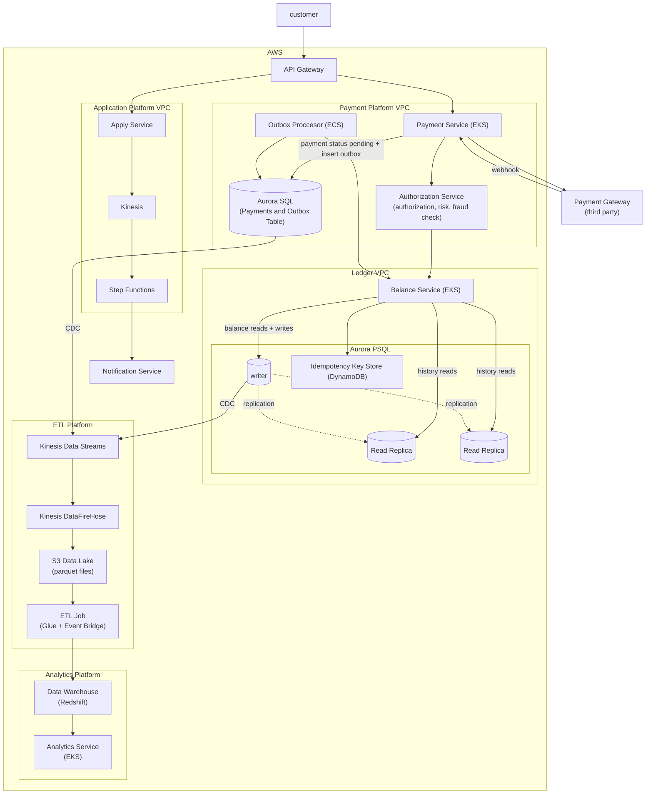

# Banking Platform

A reduced version of the online banking platform taking elements from the account balance service, online banking platform
and virtual credit card.

## Requirements

1. Apply for cards
2. Manage payments including using third party payment service
3. Payment Authorization
4. Support calculating daily, weekly and monthly statistics

## High Level Diagram



## Key Patterns

### Idempotency Key

For payments and transactions that update the balance in the ledger we use an idempotency key to prevent double charges.
The client generates this key (can be a uuid) and it is stored in the DB. Whenever a request is made we check if the key
already exists, and if this is the case we don't transfer money again and just sent back the result.

We can use a key value store to store the keys with the result to check faster and absorb load from the main db.

### Outbox Pattern

When a payment is made we need to update both the payments table as well as the ledger. As they are different databases
we need a way to ensure an atomic update.

If we try to update both, something bad can happen:

```python
# ❌ DANGEROUS - not atomic
db.payments.update(payment.id, status="posted")
ledger.debit(account_id, amount, idempotency_key)  # <- crash here?
```

If the service crashes between the database update and the ledger call:
- Database says payment is posted ✓
- Ledger was never debited ✗
- Money wasn't actually moved, but customer thinks it was

We write an event record to the payments db:

```python
# ✅ ATOMIC - both happen or neither does
with db.transaction():
    db.payments.update(payment.id, status="posted")
    db.outbox.insert({
        event_type: "payment.settled",
        payload: { payment_id, amount, account_id },
        idempotency_key: payment.idempotency_key,
        published: False
    })
# Transaction commits; both rows are in the DB
```

Then a **separate background process** drains the outbox and calls the ledger:

```python
# Background job (Outbox Processor) - runs continuously
def process_outbox():
    for event in db.outbox.find(published=False):
            # Call the external system
            ledger.debit(
                account_id=event.payload["account_id"],
                amount=event.payload["amount"],
                idempotency_key=event.idempotency_key
            )
            # Mark as published only after success
            db.outbox.update(event.id, published=True)
```

### Sharding the ledger

To scale writes across the ledger, we will need to shard. One option is to shard by account id. The challenge
are transfers between accounts in different shards. We could use 2 phase commit but that is unefficient as it helds
lock for the duration of the transaction. Instead we can use the saga pattern, for each step we have a compensation step.

So to transfer from account 1 to account 2: 

1. We reserve the money from 1 and put a pending status, so it cannot be spent anymore
2. Apply credit to 2 and mark it as posted
3. If success confirm change 1 to posted if not apply compensating step to reverse the money from 1 and mark it as reversed


