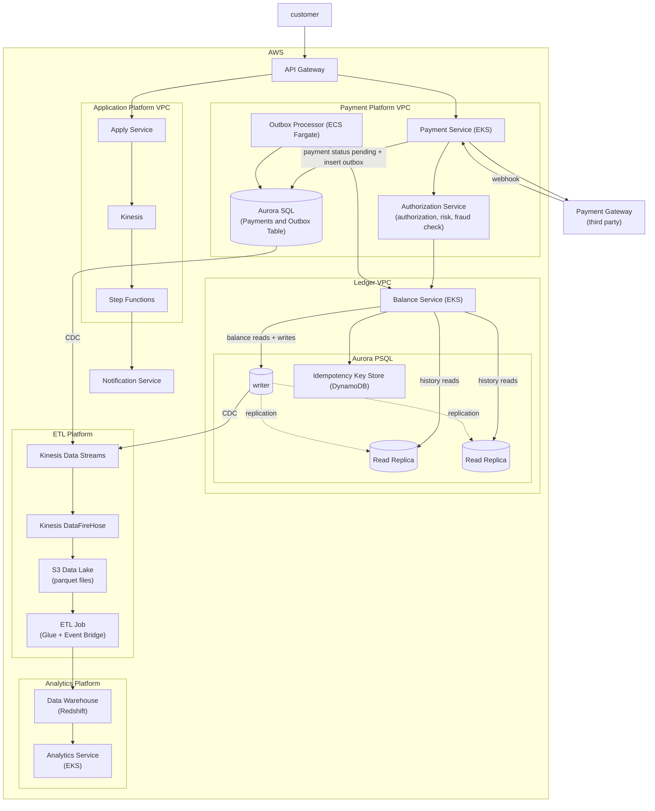

# Banking Platform

A reduced version of the online banking platform taking elements from the account balance service, online banking platform
and virtual credit card.

## Requirements

1. Apply for cards
2. Manage payments including using third party payment service
3. Payment Authorization
4. Support calculating daily, weekly and monthly statistics

## High Level Diagram



## Data Flows

### Payment Flow
1. Client sends payment request with `Idempotency-Key` header
2. Payment Service calls Authorization Service to check balance, account status, and fraud risk
3. If authorized, Payment Service calls third-party payment gateway (e.g., Stripe)
4. Payment gateway returns immediately with reference ID
5. Payment Service records payment as `pending` and atomically inserts outbox event (Outbox pattern)
6. Returns 202 (accepted) to client
7. Payment gateway processes asynchronously and calls webhook when settled
8. Webhook triggers Payment Service to update payment status to `posted`
9. Outbox Processor drains the outbox table continuously (every 1 second)
10. For each event, calls Balance Service to debit account (using idempotency key for deduplication)
11. Balance Service appends ledger entry and updates balance atomically
12. Outbox Processor marks event as `published`
13. Data flows to Kinesis CDC → Redshift for analytics

### Card Application Flow
1. Client submits application with KYC info
2. Apply Service validates and starts Step Functions workflow
3. Step Functions orchestrates: identity check → credit check → decision
4. On approval, emits event to Kinesis
5. Analytics pipeline consumes event for reporting

---

## Key Patterns

### Idempotency Key

For payments and transactions that update the balance in the ledger we use an idempotency key to prevent double charges.
The client generates this key (can be a UUID) and it is stored in the DB. Whenever a request is made we check if the key
already exists, and if this is the case we don't transfer money again and just return the cached result.

**Implementation:** We store idempotency keys in **DynamoDB** (not the main Aurora DB) with:
- Key: `idempotency_key` (UUID from client)
- Value: `{ transaction_id, status, response }`
- TTL: 24–48 hours (auto-expiring)

This approach:
- Absorbs read load from the main ledger database
- Provides sub-millisecond lookups
- Automatically expires old keys
- Handles client retries safely: retry with same key → DynamoDB cache hit → immediate response (no double-charge)

### Outbox Pattern

When a payment is made we need to update both the payments table as well as the ledger. As they are different databases
we need a way to ensure an atomic update.

If we try to update both, something bad can happen:

```python
# ❌ DANGEROUS - not atomic
db.payments.update(payment.id, status="posted")
ledger.debit(account_id, amount, idempotency_key)  # <- crash here?
```

If the service crashes between the database update and the ledger call:
- Database says payment is posted ✓
- Ledger was never debited ✗
- Money wasn't actually moved, but customer thinks it was

We write an event record to the payments db:

```python
# ✅ ATOMIC - both happen or neither does
with db.transaction():
    db.payments.update(payment.id, status="posted")
    db.outbox.insert({
        event_type: "payment.settled",
        payload: { payment_id, amount, account_id },
        idempotency_key: payment.idempotency_key,
        published: False
    })
# Transaction commits; both rows are in the DB
```

Then a **separate background process** drains the outbox and calls the ledger. The Outbox Processor runs on **ECS Fargate** (not Lambda) because:
- It continuously polls the database (not event-triggered)
- No 15-minute timeout limit
- Can handle batches of events efficiently
- Retries failed events without losing state

```python
# Background job (Outbox Processor) - runs continuously on ECS Fargate
def process_outbox():
    while True:
        for event in db.outbox.find(published=False).limit(100):
            try:
                # Call the ledger service
                result = ledger.debit(
                    account_id=event.payload["account_id"],
                    amount=event.payload["amount"],
                    idempotency_key=event.idempotency_key
                )
                # Mark as published only after success
                if result.status in [201, 409]:  # 409 = already processed (safe retry)
                    db.outbox.update(event.id, published=True)
            except Exception as e:
                # On failure: increment retry_count, retry on next cycle
                db.outbox.increment_retry(event.id)
        
        time.sleep(1)  # Poll every second
```

### Sharding the Ledger

To scale writes across the ledger, we shard by `account_id`. The challenge is transfers between accounts in different shards.

**Why not 2-Phase Commit?**  
2PC holds locks for the entire transaction duration, blocking other operations and reducing throughput. Instead, we use the **Saga pattern**.

**Saga Pattern for Transfers (Account 1 → Account 2):**

1. **Reserve funds** — Debit Account 1, mark as `pending` (cannot be spent)
2. **Credit destination** — Credit Account 2, mark as `posted`
3. **Confirm or compensate:**
   - If step 2 succeeds → confirm Account 1 to `posted`
   - If step 2 fails → compensation: reverse debit on Account 1, mark as `reversed`

**Consistency guarantees:**
- **Eventual consistency** — there's a window (milliseconds to seconds) where Account 1 shows `pending`
- **Authorization protection** — during this window, Authorization Service blocks spending (pending balance doesn't count as available)
- **Durability** — all intermediate states are recorded in the ledger; can reconstruct state by replaying

This trades immediate consistency for horizontal scalability across shards.
