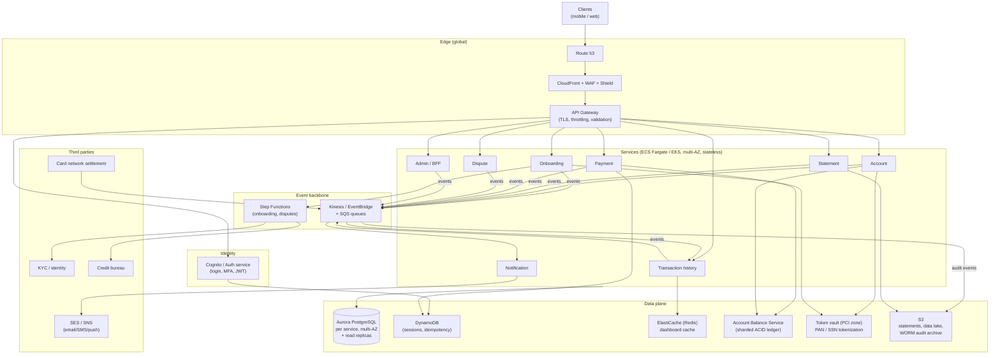

# 4. High-Level Design

## Architecture (AWS)

## Component responsibilities

| Component | Role | Why this service |
|-----------|------|------------------|
| **Route 53 + CloudFront + WAF/Shield** | Global DNS, CDN for static/statements, DDoS + L7 filtering | Absorbs and filters traffic at the edge; caches read-heavy assets. |
| **API Gateway** | TLS, authn check, throttling, schema validation | Managed edge; offloads cross-cutting concerns. |
| **Cognito / Auth service** | Login, **MFA**, JWT issuance, session mgmt | Managed identity with MFA; sessions in DynamoDB/Redis. |
| **Service fleet (ECS/EKS)** | One stateless service per bounded context | Independent scaling/deploy; blast-radius isolation for PCI/SOC 2. |
| **Step Functions** | Orchestrate onboarding & dispute workflows | Long-running, resumable, auditable multi-step processes. |
| **Kinesis / EventBridge + SQS** | Event backbone + durable work queues | Decouples producers from slow consumers; buffers peaks. |
| **Aurora (per service)** | ACID system-of-record for each domain | Strong consistency where workflows need it. |
| **Account Balance Service** | Balances, payments, postings (the ledger) | Reuse the ACID double-entry ledger; don't rebuild money. |
| **Token vault (PCI zone)** | Tokenize PAN/SSN; isolated network | Shrinks PCI-DSS scope to a small, hardened enclave. |
| **ElastiCache / DynamoDB** | Dashboard cache; sessions & idempotency | Absorb read load; fast key/value with TTL. |
| **S3** | Statement PDFs, data lake, WORM audit archive | Cheap, durable, compliant long-term storage. |
| **SES / SNS** | Email / SMS / push delivery | Managed multi-channel delivery. |

## Data flow

### Apply for a card (async workflow)

1. `POST /applications` → Onboarding service persists `submitted` and starts a
   **Step Functions** execution.
2. The workflow calls **KYC** (identity), then the **credit bureau** (score),
   updating `applications.status` at each step; slow third-party calls run with
   retries/timeouts inside the state machine, not on the request thread.
3. On approval it opens an **account** (Account service) and a **ledger
   account**, requests card issuance, and emits `application.approved`.
4. Notification service (via the bus) sends the decision; adverse decisions
   include a regulatory reason. See
   [detailed design](06-detailed-design.md#61-onboarding-workflow).

### Log in and view dashboard (read path)

1. Client authenticates via Cognito (password + MFA) → short-lived JWT.
2. Dashboard calls hit the **Admin/BFF or per-service reads**; account details,
   recent transactions and statements are served from **read replicas + Redis
   cache**, with statement PDFs from **CloudFront/S3**.
3. Balance shown is read **strongly** from the ledger; history tolerates slight
   staleness (replica/cache).

### Make a payment (write path)

1. `POST /accounts/{id}/payments` with an **Idempotency-Key**.
2. Payment service validates and calls the **Account Balance Service** to
   `transfer` funds (bank/settlement account → card account) — one ACID,
   idempotent ledger operation.
3. On commit it emits `payment.posted` → transaction history updates, a
   notification fires, and the audit log records the action.

### Transaction posted (ingest)

1. Card-network **settlement** feeds the event bus.
2. Transaction history service projects a read-optimized `transactions` row and
   the ledger records the `debit`; a `transaction.posted` notification fires.

### Dispute a charge (async workflow)

`POST /disputes` starts a **Step Functions** dispute state machine (provisional
credit → review → chargeback → resolution), each transition audited and
notified. See [detailed design](06-detailed-design.md#62-dispute-workflow).

## Key tradeoffs at this level

- **Microservices over a monolith** — the domains differ so much in consistency,
  scale and *compliance scope* (only a few touch card data) that splitting them
  lets us harden and audit a small PCI surface instead of the whole app. Cost:
  distributed-systems complexity, handled with the event bus and idempotency.
- **Reuse the ledger service** rather than re-implementing balances — money
  correctness is already solved there (ACID, double-entry, sharded, idempotent).
- **Sync for reads, async (events) for side effects** — a payment must commit
  synchronously, but notifications, history projection and audit are async so a
  slow or down downstream never blocks the customer.
- **Managed AWS building blocks** (Aurora, Step Functions, Kinesis, SES/SNS,
  Cognito, KMS) to hit 99.99% and compliance without operating that plumbing
  ourselves.
