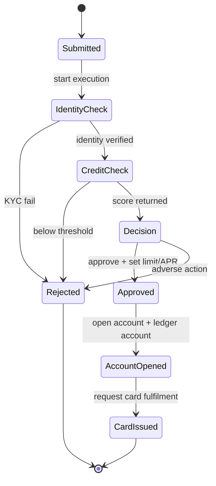
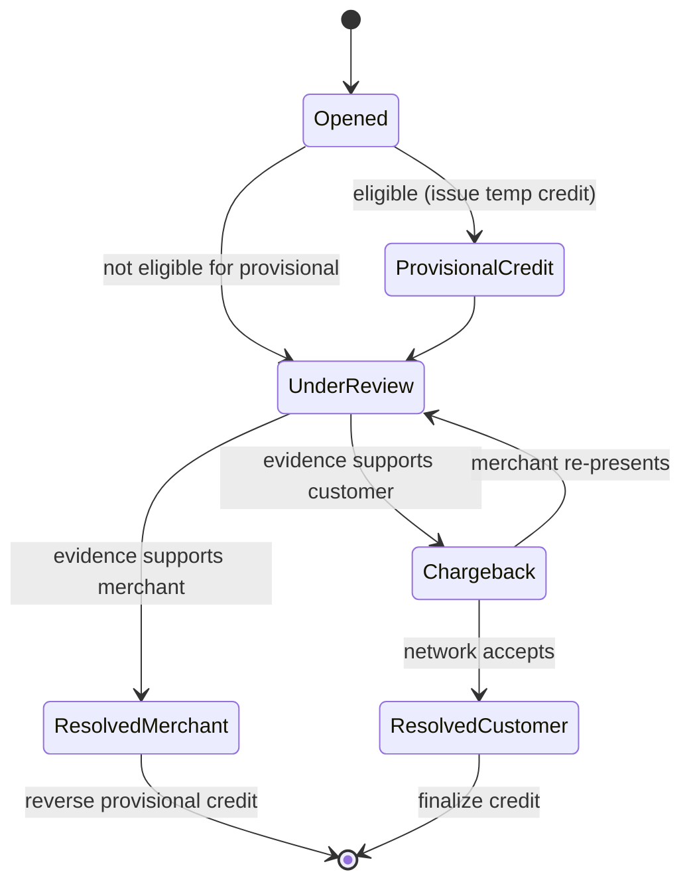
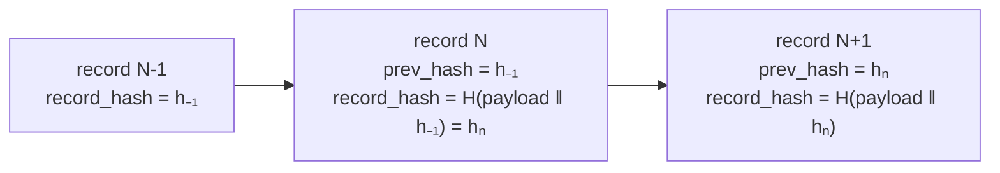

# 6. Detailed Design

Drills into the parts that make or break this platform: the two long-running
workflows (onboarding, disputes), the tamper-evident audit trail, the
security/compliance controls, and how we survive peaks and failures. The money
path itself is delegated to the
[Account Balance Service](../account_balance_service/06-detailed-design.md) and
is not re-derived here.

## 6.1 Onboarding workflow

Applying for a card is a **long-running, multi-step process** with slow external
calls (KYC, credit bureau) and regulated outcomes. We orchestrate it with a
**Step Functions** state machine so it's resumable, retryable, and auditable —
never a chain of blocking calls on a request thread.

Key properties:

- **Each transition persists `applications.status`** and emits an event, so the
  customer can poll `GET /applications/{id}` and see real progress, and the audit
  log captures the full decision trail (required for adverse-action compliance).
- **External calls are wrapped with retries + timeouts + circuit breakers** in
  the state machine. A flaky bureau retries with backoff; a hard failure routes
  to a manual-review state, not a lost application.
- **Idempotent side effects:** "open account", "open ledger account" and
  "request card" each carry an idempotency key derived from `application_id`, so
  a workflow retry never opens two accounts.
- **Approval is the only place an account is created** — the account and its
  ledger account are opened in the same step, then card issuance is requested;
  the card token comes back from the **PCI token vault**, never a raw PAN.

**Why Step Functions over a hand-rolled orchestrator or a pure event choreography:**
the workflow is stateful, has timeouts and human-in-the-loop branches, and must
be inspectable for audits. A managed state machine gives durable execution
history for free; choreographed events alone make "where is this application?"
hard to answer.

## 6.2 Dispute workflow

Disputes are **regulated** (Reg E / Reg Z style timers): the customer often gets
**provisional credit** quickly, then the case runs through review and possibly a
network chargeback, with SLA deadlines at each step. Another state machine, with
timers.

Key properties:

- **Provisional credit is a real ledger `credit`** to the customer's account,
  reversed via a compensating entry if the dispute resolves for the merchant —
  the ledger's append-only model makes "credited then reversed" fully
  traceable, never a silent balance edit.
- **`sla_due_at` timers** (Step Functions wait states / EventBridge Scheduler)
  fire escalations if a step stalls past its regulatory deadline.
- **Every transition is audited and notified** — the customer sees status
  changes; compliance can prove timers were met.

## 6.3 Payment path (delegated, kept idempotent)

A payment is thin: validate, then call the ledger's `transfer` (funding source →
card account) with an idempotency key. All the hard parts — atomicity, no
double-charge on retry, concurrency, sharding — are already solved in the
[ledger service](../account_balance_service/06-detailed-design.md). On commit the
Payment service emits `payment.posted`; history, notifications and audit react
asynchronously. This is the payoff of reusing the ledger: the platform's payment
feature is a few hundred lines, not a second ledger.

## 6.4 Tamper-evident audit trail

Requirement: **every action produces a tamper-evident audit trail.** "Append-only"
is not enough on its own — a privileged insider could rewrite history. We make
tampering *detectable* with a **hash chain** plus **WORM** storage.

- Each audit record stores `prev_hash` (previous record's hash) and
  `record_hash = H(payload ‖ prev_hash)`. The records form a **chain**: altering
  any past record changes its hash, which breaks every subsequent link. A
  verifier walking the chain detects the break immediately.
- Records are streamed to **S3 with Object Lock (compliance mode / WORM)**, so
  even an admin with S3 access cannot overwrite or delete them for the retention
  period. A periodically published **chain checkpoint** (e.g. the latest
  `record_hash` anchored in a separate account/notarized) closes the "rewrite
  the whole chain" gap.
- A **rolling window** stays queryable (DynamoDB/OpenSearch) for investigations;
  the full history lives in S3.

**Why not Amazon QLDB?** QLDB was the classic managed answer (cryptographically
verifiable ledger) but is on an end-of-support path, so we implement the same
guarantee ourselves with a hash-chained log + S3 Object Lock — portable, no
dependence on a deprecated service, and the verification logic is a few lines.

## 6.5 Admin / security controls

Security is treated as the spine of the design, mapped to the compliance
requirements:

| Control | Mechanism | Requirement served |
|---------|-----------|---------------------|
| **MFA auth** | Cognito/auth service, TOTP + SMS/push; step-up MFA for sensitive ops | Secure authn |
| **Encryption in transit** | TLS 1.2+ everywhere, mTLS between internal services | Data in transit |
| **Encryption at rest** | KMS-backed encryption on Aurora, DynamoDB, S3; envelope-encrypted PII fields | Data at rest |
| **PAN/SSN tokenization** | Token vault in an isolated **PCI zone**; other services hold only tokens + `last4` | PCI-DSS scope reduction |
| **Network segmentation** | Card-data services in a separate VPC/subnet with tight security groups | PCI-DSS |
| **Least privilege** | Per-service IAM roles; no shared DB creds; secrets in Secrets Manager | SOC 2 |
| **Four-eyes on admin** | Sensitive admin actions (adjustments, limit changes) require a second approver | SOC 2 / fraud control |
| **Tamper-evident audit** | Hash-chained WORM log (§6.4) | Audit trail |

**PCI-DSS scope reduction is the load-bearing idea:** by tokenizing the PAN at
the edge and keeping raw card data in one small, hardened enclave, the *vast
majority* of services never touch cardholder data and fall largely out of PCI
audit scope. That's why card data is isolated rather than encrypted-in-place
across every service.

## 6.6 Handling peak traffic (statement close & due dates)

The load is bursty and predictable, so the design leans on that predictability:

- **Stagger billing cycles** (`accounts.cycle_day` spread across the month) so
  statement generation and due-date payment surges are spread over ~28 days
  instead of all hitting on the 1st. This alone flattens the worst peaks.
- **Statement generation is a batch/async job** off the event bus, writing PDFs
  to S3 — it never competes with live traffic and can be rate-limited.
- **Stateless services autoscale** on request/queue metrics; **SQS queues buffer**
  payment and notification surges so a spike becomes latency, not errors.
- **Reads scale out**: dashboard/history from **read replicas + Redis**,
  statement PDFs from **CloudFront/S3** — the read-dominated peak barely touches
  primaries.
- **Notifications are decoupled**: a due-date reminder blast fans out through
  SNS/SES with its own throughput; if it lags, payments and dashboards are
  unaffected.

## 6.7 Reliability & failure handling (99.99%)

| Failure | Behavior |
|---------|----------|
| AZ outage | Multi-AZ Aurora + multi-AZ ECS; Aurora fails over (~30 s), stateless tasks reschedule; requests retry idempotently. |
| Region outage | Warm standby in a second region (replicated Aurora, cross-region S3); Route 53 failover for the DR posture. |
| Third party down (KYC/bureau) | Step Functions retries/backoff; hard failure → manual-review state, application not lost. |
| Notification pipeline down | Async + queued; messages drain later; core money/read paths unaffected. |
| Ledger `503` (writer failover) | Payment retries with the same idempotency key → no double-pay. |
| Poison event on the bus | Dead-letter queue + alarm; the projection catches up without blocking new events. |

Because side effects are event-driven and idempotent, most failures degrade a
*feature* (delayed notification, delayed history projection) rather than the
customer's core ability to view accounts and pay.

## 6.8 Summary of the core decisions

1. **Microservices by bounded context** — different consistency, scale, and
   *compliance scope* per domain; lets us harden a small PCI surface.
2. **Reuse the ACID ledger** for all money movement — payments/provisional
   credits are ledger operations, not a second balance system.
3. **Step Functions for onboarding and disputes** — long-running, resumable,
   auditable workflows with timeouts and human-in-the-loop branches.
4. **Hash-chained WORM audit log** — tamper-*evident*, not just append-only, and
   independent of any deprecated managed ledger.
5. **Security as the spine** — MFA, encryption everywhere, and PAN/SSN
   tokenization to shrink PCI-DSS scope to a small enclave.
6. **Async + idempotent side effects** — notifications, history and audit react
   to events, so slow/failed downstreams never block the customer.
7. **Design for the known peaks** — staggered cycles, autoscaling, queue
   buffering, and read replicas/CDN turn statement-close and due-date surges into
   latency, not outages.
