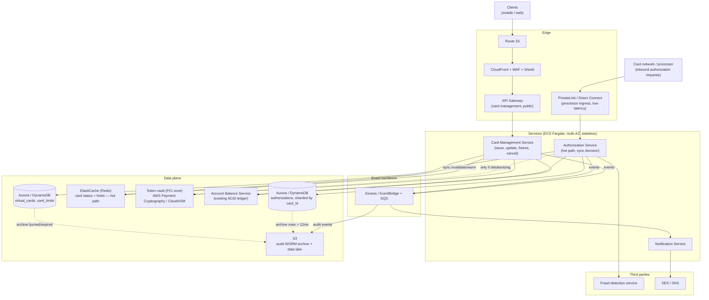

# 4. High-Level Design

## Architecture (AWS)

## Component responsibilities

| Component | Role | Why this choice |
|-----------|------|------------------|
| **Route 53 + CloudFront + WAF/Shield** | Public edge for customer-facing traffic | DDoS/L7 filtering, CDN for static assets. |
| **API Gateway** | TLS, authn check, throttling, schema validation for card management | Managed edge; offloads cross-cutting concerns from the service. |
| **PrivateLink / Direct Connect** | Dedicated, low-latency ingress from the card network/processor | Authorization has a hard latency budget — it never goes through the public CDN/WAF path used by browsers. |
| **Card Management Service** | Issue, update, freeze/unfreeze, cancel | Owns `virtual_cards`/`card_limits`; the only writer of card state. |
| **Authorization Service** | Synchronous approve/decline decision on every charge | Separated from card management because its latency/availability SLA is an order of magnitude tighter (§ below). |
| **ElastiCache (Redis)** | Card status + limits, read on every authorization | Sub-millisecond lookup for the hot path; a DB round trip per authorization wouldn't fit the SLA. |
| **Token vault (PCI zone)** | Generate/store PAN + CVV; decrypt only inside an isolated enclave | Shrinks PCI-DSS scope to one small, hardened component instead of the whole system. |
| **Account Balance Service** | Balance/credit-line check and debit | Reused, not reimplemented — money correctness already lives there. |
| **Fraud detection service** | Additional real-time risk check during authorization | Existing system ([fraud_detection.md](../fraud_detection.md)); this design doesn't re-derive behavioral fraud scoring. |
| **Kinesis/EventBridge + SQS** | Event backbone for everything that isn't on the sync decision path | Decouples audit, notifications, and archival from card management/authorization latency. |
| **S3** | WORM audit archive, cold storage for expired cards and old authorizations | Cheap, durable, compliant long-term retention. |

## Data flow

### Issue a card (sync, sub-second)

1. `POST /v1/cards` → Card Management Service validates the customer/account
   (calls the ledger), then calls the **token vault** to generate a
   network-valid PAN + CVV + expiry.
2. The vault returns a `pan_token` (never the raw PAN back to the general
   app). Card Management Service writes `virtual_cards`/`card_limits`, warms
   the Redis entry, and returns the card to the client — the **full PAN is
   fetched directly from the vault for one-time display only**, never logged,
   never persisted outside the vault.
3. Emits `card.created` on the event bus → audit log, asynchronously.

### Freeze / unfreeze / cancel (sync status flip)

1. `POST /v1/cards/{id}/freeze` (or unfreeze/cancel) updates `virtual_cards.status`
   **and** synchronously updates the Redis entry in the same request — the
   authorization path must never approve a charge against a card the customer
   just froze.
2. Emits an event for audit; no other service needs to react synchronously.

### Authorize a charge (sync, tight SLA)

1. Processor calls the Authorization Service with the token/card reference,
   amount, merchant, and MCC.
2. Card status + limits are read from **Redis** (cache miss falls back to the
   DB, which is rare given the write-through pattern above).
3. If the card is frozen, cancelled, expired, over its limit, or the merchant
   is restricted → **decline**, no further calls needed.
4. Otherwise: call the **fraud detection service** and the **ledger**
   (balance/credit-line check + debit) in parallel where possible; combine
   results into approve/decline.
5. If the card is `one_time` and the decision is approve, flip it to `burned`
   (same request, so a replayed/duplicate authorization can't reuse it).
6. Return the decision to the processor; **asynchronously** write the
   `authorizations` row and emit an audit event.

### Notifications & audit (async, always)

Every service emits domain events to the bus; the Notification Service
fans out customer-visible alerts (card frozen, large charge, card issued),
and the Audit Service writes the tamper-evident log — neither is on the
critical path of any customer-facing call.

## Key tradeoffs at this level

- **Authorization Service is split from Card Management**, even though both
  touch the same card — issuance is a few hundred requests/sec with a
  sub-second budget, authorization is thousands/sec with a sub-second-of-a-
  second budget. Coupling them would force the low-volume path to inherit the
  high-volume path's operational constraints (and vice versa).
- **Cache is the source of truth for the authorization decision's fast path**,
  not the database — this trades a sliver of staleness risk for the latency
  the SLA demands, and is why freeze/cancel writes update the cache
  **synchronously** rather than relying on eventual cache invalidation.
- **PCI scope is isolated to the vault**, not spread across services — every
  other datastore only ever sees a token and `last4`. Costs one extra network
  hop on issuance; saves an enormous compliance surface everywhere else.
- **Reuse the ledger service** for balance/credit checks — this system's job
  is card *rules*, not money; the ledger's ACID guarantees are not
  re-derived here.
- **Async for audit/notifications** — a slow or degraded audit/notification
  pipeline must never cause a customer-facing decline or a stalled issuance
  call.
