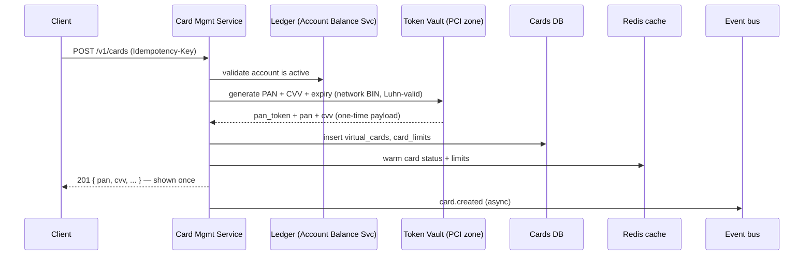
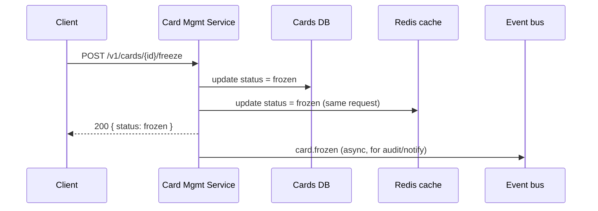
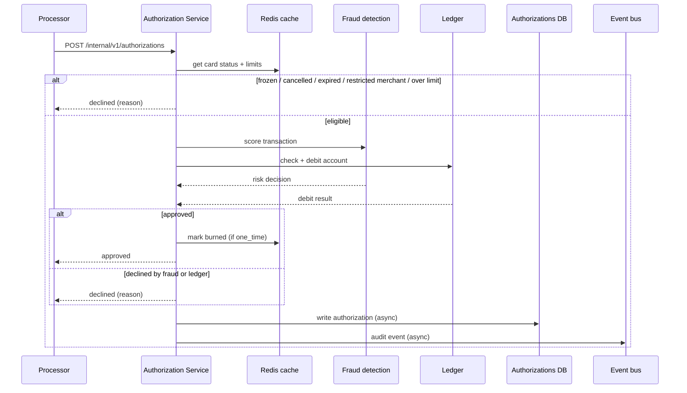

# 6. Detailed Design

Drills into the parts that make or break this system: the issuance call, how
a freeze/cancel becomes true everywhere instantly, why PAN data is isolated
the way it is, the authorization hot path and its one-time-use semantics, the
audit trail, and how the system survives peaks and failures. The money path
itself (balance checks, debits) is delegated to the
[Account Balance Service](../account_balance_service/06-detailed-design.md)
and is not re-derived here.

## 6.1 Card issuance flow

- **The vault, not Card Management, generates the PAN/CVV** — Card Management
  only ever holds `pan_token`. The raw values pass through it once, in
  memory, to build this single response; they are never written to
  `virtual_cards`, logs, or any cache.
- **Idempotency key** guards against a client retry after a timeout minting a
  second live card against the same account.
- **Cache is warmed synchronously**, not lazily on first authorization — a
  one-time-use card issued and used seconds later must already be in Redis
  by the time the first authorization arrives.

## 6.2 Freeze, unfreeze, cancel — cache consistency

A frozen card must not authorize the *next* transaction, which may arrive
milliseconds after the freeze call returns. That rules out eventual cache
invalidation.

Both the DB write and the cache write happen **inside the request**, before
the `200` is returned. This is the one place the design pays a small
synchronous cost (two writes instead of one) to buy a hard guarantee: by the
time the customer sees "frozen," the authorization path already agrees.

## 6.3 PCI-DSS scope reduction

The core requirement — PAN/CVV stored and transmitted per PCI-DSS — is
satisfied by **isolating raw card data to one component** rather than
encrypting it in place everywhere it's used:

- The **token vault** is the only place a raw PAN or CVV ever exists in
  cleartext (post-decryption), and only transiently, inside its own
  hardened enclave (separate VPC, its own IAM boundary, HSM/KMS-backed
  envelope encryption).
- Every other service — Card Management, Authorization, the cards DB, the
  authorizations table, logs, caches — holds only a `pan_token` and `last4`.
  A breach anywhere outside the vault yields no usable card numbers.
- The **authorization hot path deliberately avoids calling the vault.** The
  processor is expected to route authorizations by `pan_token`/`card_id`
  (our identifier), not a detokenized PAN, so the common case never touches
  the vault at all. The vault is only called on issuance (generate) and rare
  out-of-band flows (customer support PAN reveal, dispute evidence) — see the
  dashed edge in [04](04-high-level-design.md).
- This is the same reasoning the [online banking platform](../online_banking_platform/06-detailed-design.md#65-adminsecurity-controls)
  applies to PAN/SSN: **shrink the audit boundary to a small enclave** instead
  of hardening every service to the same standard.

## 6.4 Authorization decision path

The hottest, tightest-SLA path in the system — thousands of requests/second,
each needing a decision inside the card network's authorization timeout
(see [02](02-estimation.md#throughput)).

Key properties:

- **Cheap, cache-only checks run first** (status, limits, merchant
  restriction) and can decline without calling the fraud engine or the
  ledger at all — the majority of declines (frozen card, expired, restricted
  MCC) resolve in a single Redis read.
- **One-time-use cards burn atomically with approval** — the cache update
  that marks the card `burned` happens as part of the same authorization that
  approved it, so a duplicate/replayed authorization for the same card
  reliably sees `burned` and declines. This is the card-level equivalent of
  the ledger's idempotency key.
- **The DB write and audit event are async** — the decision is returned to
  the processor the instant it's known; persisting the record and emitting
  the audit trail never adds to the customer/merchant-visible latency.
- **Fail-open vs. fail-closed is an explicit choice per dependency**, not a
  single global policy:
  - **Ledger unreachable → fail closed (decline).** We cannot approve a debit
    we can't perform; approving without a successful debit risks an
    unrecoverable balance discrepancy.
  - **Fraud service unreachable/timed out → fail open (approve), flagged for
    async review.** Blocking all commerce on a dependency blip is a worse
    outcome than temporarily accepting a small amount of extra fraud risk on
    unscored transactions; the [fraud detection system](../fraud_detection.md)
    already treats "flagged despite being allowed" as a first-class case.
  - **Cache unreachable → fall back to a direct (slower) DB read**, not a
    decline — correctness is unaffected, only latency, and the fallback path
    is exercised routinely by cold cards, not just outages.

## 6.5 Audit trail

Every action — issuance, update, freeze/unfreeze/cancel, every authorization
decision — is written to the same hash-chained, WORM `audit_log` used by the
[online banking platform](../online_banking_platform/06-detailed-design.md#64-tamper-evident-audit-trail):
each record stores `prev_hash` and `record_hash = H(payload ‖ prev_hash)`,
forming a chain where altering any past record is detectable, streamed to S3
with Object Lock. This design reuses that mechanism rather than inventing a
second one — the requirement ("audit log every action") is identical in
shape to the online banking platform's, just with card-specific `action`
values (`card.created`, `card.frozen`, `authorization.declined`, ...).

## 6.6 Handling peak traffic

- **Authorization peaks are absorbed by the cache, not the database** — at
  ~3,500 TPS peak, a design that read `virtual_cards`/`card_limits` from
  Aurora on every authorization would need heavy read-replica fan-out; Redis
  at that volume is comfortable on a small cluster.
- **Issuance peaks (checkout-flow bursts) autoscale the stateless Card
  Management fleet** on request metrics — issuance has no shared mutable
  state to contend over per request beyond the DB insert.
- **The event bus buffers everything non-critical** (audit, notifications) —
  a burst of card creations or authorizations becomes queue depth, not
  errors, on the async side.

## 6.7 Reliability & failure handling

| Failure | Behavior |
|---------|----------|
| AZ outage | Multi-AZ Aurora/Redis + multi-AZ ECS; stateless tasks reschedule; requests retry idempotently. |
| Redis node down | Fall back to DB read for card status/limits (higher latency, same correctness); cache warms back up as traffic returns. |
| Ledger unreachable | Authorization fails **closed** — decline (§6.4). Issuance retries with backoff (customer sees a retryable error, not a bad card). |
| Fraud service unreachable/slow | Authorization fails **open** — approve, flag for async review (§6.4). |
| Vault unreachable | Issuance fails (no card can be minted without a PAN) — but authorization is unaffected, since the hot path doesn't call the vault. |
| Poison event on the bus | Dead-letter queue + alarm; audit/notification projections catch up without blocking new events. |

## 6.8 Summary of core decisions

1. **Card Management and Authorization are separate services** despite
   sharing data — their volume and latency profiles differ by an order of
   magnitude.
2. **Freeze/unfreeze/cancel write through to the cache synchronously** — the
   customer-visible guarantee has to hold the instant the call returns.
3. **PCI scope is isolated to one vault component**, and the hot
   authorization path is designed to avoid calling it at all in the common
   case.
4. **One-time-use cards burn atomically with the approving authorization** —
   the same mechanism idempotency keys give the ledger, applied at the card
   level.
5. **Fail-open/fail-closed is decided per dependency**, based on which
   failure mode is worse: an unrecoverable ledger discrepancy (closed) versus
   blocking legitimate commerce on a fraud-engine blip (open).
6. **Reuse existing systems** — the ledger for money, the fraud engine for
   risk scoring, the hash-chained audit log pattern from the online banking
   platform — rather than re-implementing any of them here.
